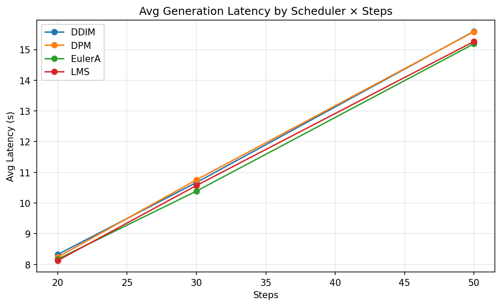
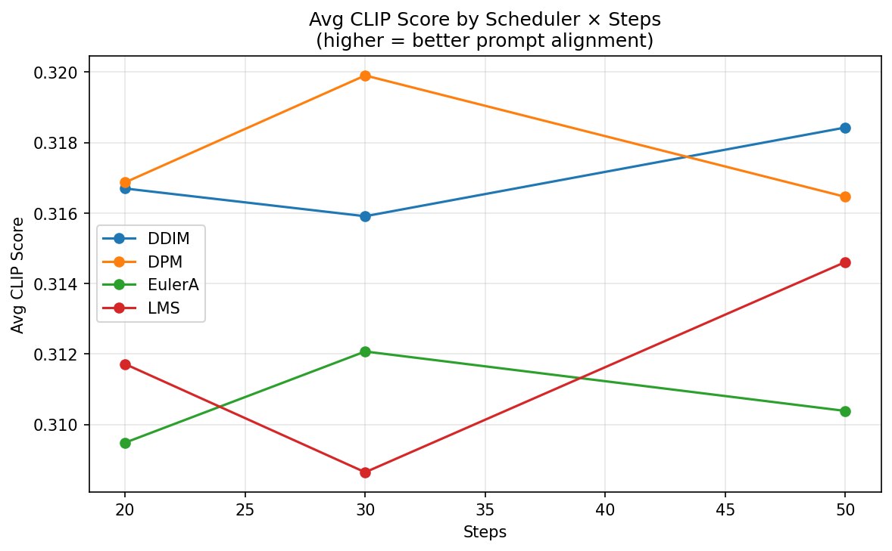
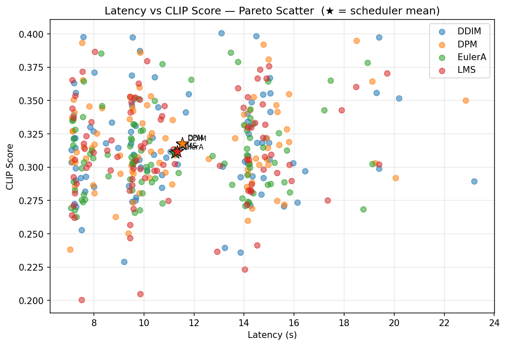
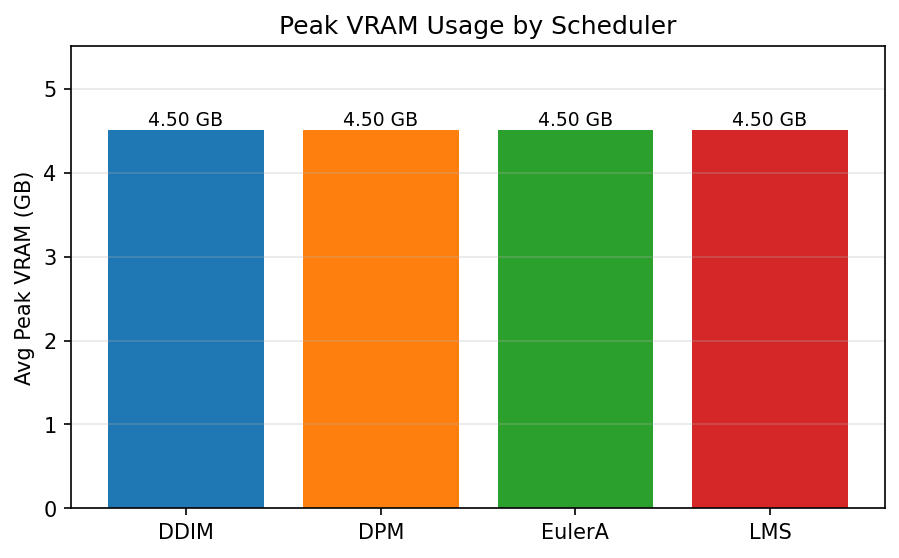

# AetherArt

AetherArt — text-to-image generator with **Stable Diffusion 2.1** (`sd2-community/stable-diffusion-2-1`) and optional **SDXL** (`stabilityai/stable-diffusion-xl-base-1.0`) support. Runs locally on GPU with Gradio UI or via Hugging Face Inference API.

## Features
- Default: `sd2-community/stable-diffusion-2-1` (recommended)
- Optional: `stabilityai/stable-diffusion-xl-base-1.0` (SDXL) — high-quality / higher VRAM
- Adjustable generation: steps, guidance, width, height, seed
- VRAM optimizations: attention slicing, CPU offload, xformers support
- Real-time progress tracking in UI
- Optional seed for reproducible generations
- PNG metadata + sidecar JSON written on every generation (prompt, seed, scheduler, VRAM, etc.)
- "Recreate from PNG" — upload any previously generated image to restore its settings

## Benchmark

Evaluated against a 30-prompt PartiPrompts subset spanning 11 categories (Animals, Outdoor Scenes, World Knowledge, People, Artifacts, Arts, Food & Beverage, Indoor Scenes, Abstract, Vehicles, Produce & Plants). Metric: CLIP score (prompt-image cosine similarity via `openai/clip-vit-base-patch32`). 360 generations total: 4 schedulers × 3 step counts × 30 prompts, seed = 42, RTX 3070 8 GB.

### Scheduler comparison

| Scheduler | Avg CLIP | Latency @ 20st | Latency @ 30st | Latency @ 50st | Verdict |
|---|---|---|---|---|---|
| **DPM-Solver++** | **0.3177** | 8.2 s | 10.8 s | 15.6 s | **Recommended default** |
| DDIM | 0.3170 | 8.3 s | 10.7 s | 15.6 s | Tied for top quality |
| LMS | 0.3117 | 8.1 s | 10.6 s | 15.3 s | Higher variance |
| Euler-Ancestral | 0.3106 | 8.2 s | 10.4 s | 15.2 s | Slightly lower quality |

### Key findings

- **DPM-Solver++ is the recommended default** — highest average CLIP with no latency penalty over DDIM
- **Step count has negligible effect on quality** — 20 → 50 steps shifts CLIP by < 0.002 while doubling compute; **30 steps is the sweet spot**
- **VRAM is uniform at 4.50 GB** across all schedulers (model CPU offload is the binding constraint, not the scheduler)
- **Photo-realistic outdoor scenes are SD 2.1's weak spot** — "a professional photo of a sunset behind the grand canyon" scored 0.20 (lowest); use SDXL for landscape photography prompts
- **Styled animals score highest** — "a shiba inu wearing a beret and black turtleneck" hit 0.40 CLIP (global best)

| Chart | |
|---|---|
|  |  |
|  |  |

Run the full benchmark: `python scripts/eval.py`
Smoke test (1 prompt, 1 scheduler): `python scripts/eval.py --prompts-subset pp_002 --schedulers DPM --steps 30`