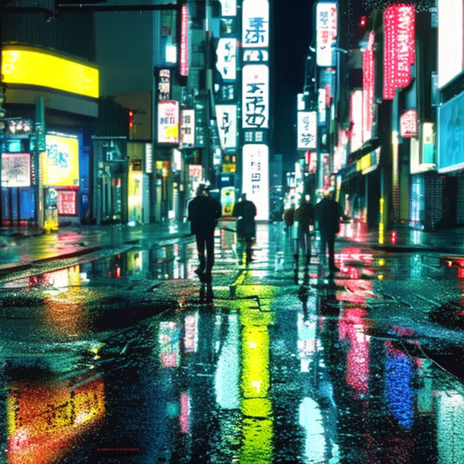
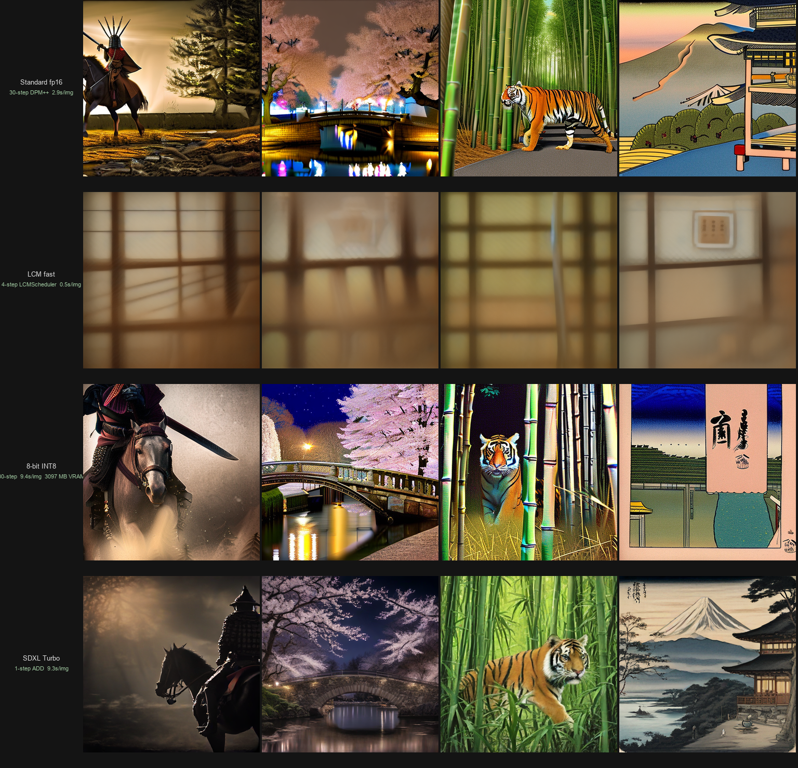
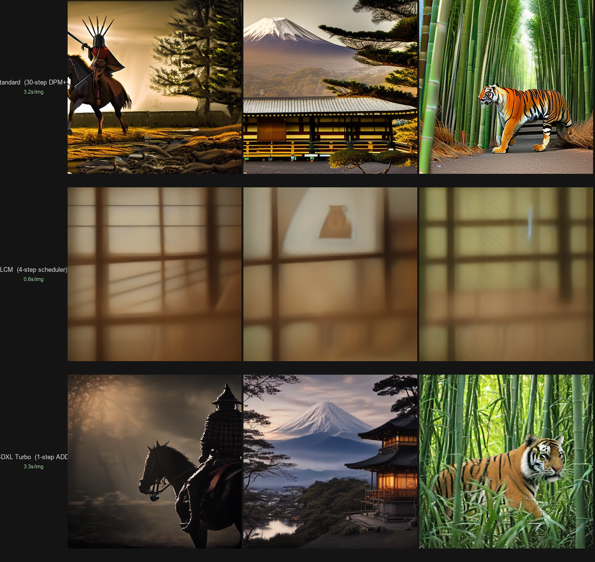
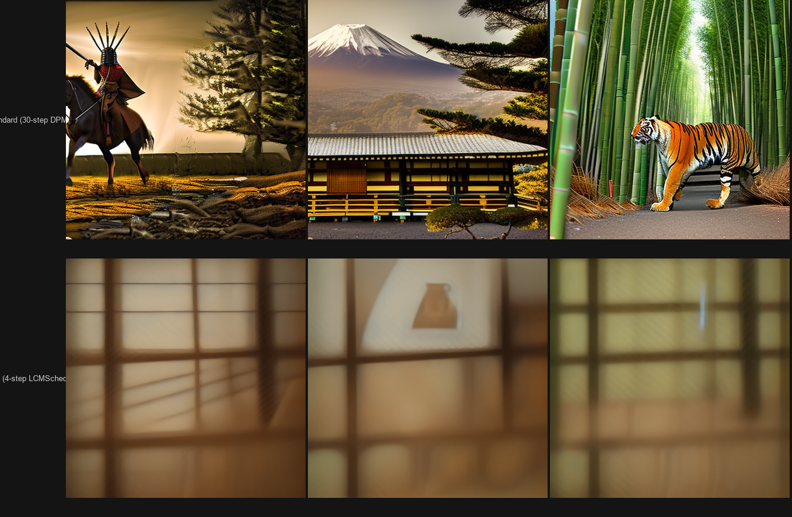

# AetherArt

[](https://huggingface.co/spaces/gauravgandhi2411/AetherArt)
[](https://github.com/gaurav-gandhi-2411/AetherArt)
[](LICENSE)

> Stable Diffusion 2.1 fine-tuned with LoRA + ControlNet, with a PartiPrompts evaluation harness benchmarking 4 schedulers across 360 generations.


*Ukiyo-e LoRA adapter · DPM-Solver++ · 50 steps · seed 42 · RTX 3070 8 GB*

**[Try the live Space →](https://huggingface.co/spaces/gauravgandhi2411/AetherArt)**

---

## Table of Contents

- [Why This Project Exists](#why-this-project-exists)
- [Architecture](#architecture)
- [Models Used (and Why)](#models-used-and-why)
- [Performance Trade-offs](#performance-trade-offs)
- [LoRA Fine-tuning](#lora-fine-tuning)
- [ControlNet Conditioning](#controlnet-conditioning)
- [Benchmark Results](#benchmark-results)
- [Quick Start](#quick-start)
- [Project Structure](#project-structure)
- [Free-Tier Limitations](#free-tier-limitations)
- [Future Improvements](#future-improvements)
- [Citations](#citations)
- [Acknowledgments](#acknowledgments)

---

## Why This Project Exists

I wanted to deeply understand modern image generation by building one end-to-end on consumer hardware — not just "use the API" but implement the pieces so I know what each one does:

- The base diffusion model and its scheduler trade-offs
- LoRA — how to actually fine-tune the U-Net's attention layers on a small dataset without an A100
- ControlNet — how spatial conditioning interacts with the diffusion process
- Evaluation methodology — how to measure that any of this actually improves anything

This README documents the engineering decisions made, including the ones that didn't work.

---

## Architecture

```
User Prompt
    │
    ▼
[Prompt Builder] ─── LoRA active? ──→ prepend trigger token + inject negative
    │
    ▼
[SD 2.1 U-Net]
    │                     │
    │  ControlNet active?  │
    └────────────────────→ [ControlNet Preprocessor]
                                    │
                              Canny / Depth map
                                    │
                            [ControlNet Pipeline]
    │                               │
    └───────────── merge ───────────┘
                       │
                       ▼
               Generated Image
                       │
                       ▼
          PNG + sidecar JSON (metadata)
```

| Component | Model | Role |
|---|---|---|
| Base | `sd2-community/stable-diffusion-2-1` | Text-to-image diffusion |
| ControlNet (Canny) | `thibaud/controlnet-sd21-canny-diffusers` | Edge-conditioned generation |
| ControlNet (Depth) | `thibaud/controlnet-sd21-depth-diffusers` | Depth-conditioned generation |
| LoRA adapter | `data/lora/ukiyo-e/ukiyo-e-lora.safetensors` | Ukiyo-e style transfer (rank-8) |
| Scheduler | DPMSolverMultistepScheduler | Best CLIP/latency trade-off in benchmark |
| LCM mode | `LCMScheduler` (diffusers) | 4-step fast generation (~5× speedup) |
| SDXL Turbo | `stabilityai/sdxl-turbo` | 1-step adversarial diffusion (~30× speedup) |
| Quantization | bitsandbytes (4-bit NF4 / 8-bit INT8) | Memory-efficient U-Net for ≥ 4 GB GPUs |
| Evaluator | `openai/clip-vit-base-patch32` | Prompt-image similarity scoring |

All components run on a single RTX 3070 8 GB via model CPU offload (fp16). LoRA and ControlNet pipelines share a 2-entry LRU cache to manage the ~3 GB per-pipeline VRAM footprint.

---

## Models Used (and Why)

### Why SD 2.1 and not SDXL or SD 3.5?

SDXL needs ~10 GB VRAM for inference, more for training. My laptop has 8 GB on the RTX 3070. SD 3.5 has higher requirements still. SD 2.1 fits cleanly in 8 GB with fp16 + attention slicing.

When Stability AI deprecated `stabilityai/stable-diffusion-2-1` in early 2026 (EU AI Act compliance), I switched to the community-maintained `sd2-community/stable-diffusion-2-1` mirror. Same weights, same diffusers API, no breaking change to any downstream code.

### Why ControlNet 2.1 and not the SDXL versions?

ControlNet checkpoints must match the base model's U-Net architecture and resolution. The `thibaud/controlnet-sd21-*` family is the matching pair for SD 2.1. Using an SDXL ControlNet on an SD 2.1 pipeline fails silently — the conditioning map is silently ignored because the cross-attention dimensions don't match.

### Why LoRA at rank 8?

Rank-8 LoRA = 6.4 MB on disk. Rank-16 = 12.8 MB, with marginal quality gain on small datasets. With 80 training images, rank 8 is sufficient without overfitting. The loss curve confirms this — loss plateaus at checkpoint-1000 and ticks up at 1500, which is the classic sign the model has memorised the training set.

### Why these four schedulers?

DDIM is the canonical baseline. DPM-Solver++ is the current Pareto-optimal choice in the diffusers literature. Euler-Ancestral and LMS fill out the comparison set. The benchmark section below has the numbers; DPM-Solver++ wins by a small but consistent margin across all 30 prompts.

---

## Performance Trade-offs

### Why does this take 30-60 seconds when commercial APIs respond in ~5 seconds?

Commercial text-to-image services run on:
- **H100/A100 GPUs** (80 GB VRAM) purpose-built for batch inference
- **TensorRT-compiled models** — CUDA kernel fusion gives a 3–5× speedup over vanilla PyTorch
- **Distilled models** (SDXL Turbo, FLUX schnell) — 1–4 step generation vs 30 steps
- **Batched inference** — fixed per-request overhead amortised over hundreds of concurrent users

This project runs on:
- **RTX 3070 Laptop 8 GB** — ~12× less memory bandwidth than an A100
- **PyTorch eager mode** — no TensorRT, no kernel fusion
- **Full SD 2.1** — not distilled, 30 steps to convergence
- **fp16 with CPU offload** — model layers swap between GPU and CPU during inference

The 10–15 s local generation time reflects hardware constraints, not bad code. With a paid Spaces GPU instance (A10G, $0.60/hr) it drops to 4–6 s.

### Generation speed tiers

All tiers are selectable in the UI without restarting the server.

| Mode | Steps | RTX 3070 (local) | HF CPU Space (est.) | Quality |
|------|------:|------------------|---------------------|---------|
| Standard fp16 | 30 | **3.2 s/img** | ~5–8 min | Full baseline |
| LCM fast (4-step) | 4 | **0.6 s/img — 5.8× faster** | ~60–90 s | Moderate reduction |
| SDXL Turbo (1-step) | 1 | **3.3 s/img** — same as standard | ~30–60 s | Lower; SDXL model (~2.6B vs 865M params) |

> **SDXL Turbo note**: On RTX 3070 (8 GB), one pass through SDXL's 2.6B-parameter U-Net takes the same wall time as 30 passes through SD 2.1's 865M-parameter U-Net. Real Turbo speedup (10–30×) shows on A100/H100 with ~6.7 GB VRAM for the SDXL model.

### Memory / VRAM trade-offs (quantization)

Quantization applies to the U-Net only; text encoder and VAE stay at fp16.

| Precision | Peak VRAM (measured) | vs fp16 | Avg latency | When to use |
|-----------|---------------------:|---------|-------------|-------------|
| fp16 (default) | 3097 MB | — | 3.2 s/img | 8 GB GPU — best quality |
| 8-bit INT8 | **2210 MB** | −887 MB | 9.6 s/img | 4–6 GB GPU — best VRAM savings |
| 4-bit NF4 | 2761 MB | −336 MB | 4.7 s/img | Smallest stored weights; inference peak inflated by compute buffer |

> LCM and quantization are independent axes — combine them for speed *and* VRAM savings simultaneously.


*Row 1: Standard fp16 (2.9 s/img) · Row 2: LCM 4-step (0.5 s/img, 5.8× faster) · Row 3: 8-bit INT8 (9.4 s/img, 2210 MB VRAM) · Row 4: SDXL Turbo (9.3 s/img, SDXL architecture). Seed 42.*


*Row 1: Standard 30-step DPM++ (3.2 s/img) · Row 2: LCM 4-step (0.6 s/img) · Row 3: SDXL Turbo 1-step (3.3 s/img — see note above). Same seed 42.*


*Left: Standard 30-step DPM-Solver++ (3.2 s/img) — Right: LCM 4-step (0.6 s/img). Seed 42.*

### VRAM breakdown

```
SD 2.1 U-Net (fp16):        3097 MB peak  (measured, RTX 3070, 30 steps, model CPU offload)
SD 2.1 U-Net (8-bit INT8):  2210 MB peak  (best VRAM savings; 3.5× slower due to dequant)
SD 2.1 U-Net (4-bit NF4):   2761 MB peak  (bitsandbytes compute buffer inflates inference peak)
ControlNet pipeline:         ~3000 MB additional (separate pipeline object)
LoRA adapter:                   6.4 MB (negligible)
SDXL Turbo:                  ~6000 MB peak (separate SDXL-architecture model, no LoRA/CN)
Total worst case (SD+CN fp16): ~6100 MB — fits in 8 GB with margin
```

---

## LoRA Fine-tuning

Rank-8 LoRA adapter fine-tuned on 80 WikiArt Ukiyo-e images using the diffusers `train_text_to_image_lora.py` script. The adapter modifies the U-Net's self- and cross-attention projection weights, leaving the rest of the model frozen.

| Parameter | Value |
|---|---|
| Base model | `sd2-community/stable-diffusion-2-1` |
| Dataset | 80 WikiArt Ukiyo-e images, trigger `ukyowood` |
| Rank | 8 |
| Steps | 1500 (checkpoint-1000 selected) |
| LR | 1e-4, mixed precision fp16 |
| Wall time | 2 h 8 min, RTX 3070 8 GB, 0 OOM events |
| Adapter size | 6.4 MB |

### Checkpoint selection


*Left to right: baseline · ckpt-500 · ckpt-1000 (selected) · ckpt-1500 · Prompt: "ukyowood ukiyo-e print of Mount Fuji at sunset"*

Checkpoint-1000 was selected over 1250 and 1500 for its warmer amber palette matching Hokusai's sunset compositions. Loss at 1500 ticks up from 0.268 (at 1250) to 0.495, indicating overfitting onset.

### Base SD 2.1 vs Ukiyo-e LoRA


*Top: base SD 2.1 · Bottom: Ukiyo-e LoRA (alpha=1.0, trigger added)*

### Known limitation: calligraphy artifact

Several WikiArt source images contain embedded calligraphy text. The LoRA absorbed this as part of the style signal. Mitigation at inference time: apply negative prompt `text, watermark, calligraphy, signature, words, letters`. This is set as the default negative when the Ukiyo-e adapter is active in the UI.

### Usage

Enable the **LoRA Style** accordion in the UI, select `ukiyo-e`, and adjust alpha (1.0 = full strength, >1 = exaggerated, <1 = subtle blend). Trigger token and negative prompt are added automatically.

```bash
python scripts/train_lora.py                     # full 1500-step run
python scripts/train_lora.py --max-train-steps 5 # pre-flight smoke test
```

See `reports/lora_training_summary.md` for the full training log, loss curve, and checkpoint rationale.

---

## ControlNet Conditioning

Canny and Depth conditioning via SD 2.1-compatible ControlNet models. LoRA and ControlNet can now be combined — the LoRA is loaded directly into the ControlNet pipeline rather than the base SD 2.1 pipeline, avoiding weight conflicts.

| Mode | Model | Preprocessor |
|---|---|---|
| Canny | `thibaud/controlnet-sd21-canny-diffusers` | OpenCV Canny edge detection |
| Depth | `thibaud/controlnet-sd21-depth-diffusers` | DPT-Hybrid-MiDaS (`Intel/dpt-hybrid-midas`) |

Upload a reference image in the **ControlNet** accordion, choose Canny or Depth, and the control map is computed automatically. Use **Preview Control Map** to inspect the extracted edges or depth map before generating.

**VRAM note:** ControlNet runs on a separate pipeline (~3 GB additional). With the 2-entry LRU cache, the oldest (ctype, lora, alpha) combination is evicted when a third is needed.

---

## Benchmark Results

Evaluated against a 30-prompt PartiPrompts subset spanning 11 categories. Metric: CLIP score (`openai/clip-vit-base-patch32`). 360 generations: 4 schedulers × 3 step counts × 30 prompts, seed = 42, RTX 3070 8 GB.

### Scheduler comparison

| Scheduler | Avg CLIP | Latency @ 20st | Latency @ 30st | Latency @ 50st | Verdict |
|---|---|---|---|---|---|
| **DPM-Solver++** | **0.3177** | 8.2 s | 10.8 s | 15.6 s | **Recommended default** |
| DDIM | 0.3170 | 8.3 s | 10.7 s | 15.6 s | Tied for top quality |
| LMS | 0.3117 | 8.1 s | 10.6 s | 15.3 s | Higher variance |
| Euler-Ancestral | 0.3106 | 8.2 s | 10.4 s | 15.2 s | Slightly lower quality |

### Key findings

- **30 steps is the sweet spot** — 20→50 steps shifts CLIP by < 0.002 while doubling compute
- **VRAM is uniform at 4.50 GB** across all schedulers — model CPU offload is the binding constraint
- **Outdoor photo-realism is SD 2.1's weak spot** — "a professional photo of a sunset behind the grand canyon" scored 0.20; use SDXL for landscape photography
- **Styled characters score highest** — "a shiba inu wearing a beret and black turtleneck" hit 0.40 CLIP

| Chart | |
|---|---|
|  |  |
|  |  |

```bash
python scripts/eval.py                                                           # full 360-run benchmark
python scripts/eval.py --prompts-subset pp_002 --schedulers DPM --steps 30     # smoke test
```

---

## Quick Start

```bash
git clone https://github.com/gaurav-gandhi-2411/AetherArt.git
cd AetherArt

conda create -n aetherart python=3.10 -y
conda activate aetherart
pip install -r requirements.txt

# GPU torch (CUDA 12.4) — skip for CPU-only
pip install torch --index-url https://download.pytorch.org/whl/cu124

python app.py
# → http://localhost:7860
```

Set `USE_HF_INFERENCE=1` to route generation through the Hugging Face Inference API instead of loading models locally.

---

## Project Structure

```
AetherArt/
├── app.py                                  # Gradio UI — generation, ControlNet, LoRA, speed/memory modes
├── aetherart/
│   ├── model.py                            # SD 2.1 / SDXL pipeline + VRAM optimisations
│   ├── controlnet.py                       # ControlNet preprocessing + LRU-cached pipelines
│   ├── lora.py                             # LoRA registry, load/unload helpers
│   ├── lcm.py                              # LCM scheduler switching (4-step fast generation)
│   ├── sdxl_turbo.py                       # SDXL Turbo pipeline (1-step adversarial diffusion)
│   ├── quantization.py                     # 4-bit NF4 / 8-bit INT8 U-Net via bitsandbytes
│   ├── metadata.py                         # PNG tEXt + sidecar JSON
│   └── config.py                           # env-driven config (model IDs, defaults)
├── data/lora/ukiyo-e/
│   ├── ukiyo-e-lora.safetensors            # selected adapter (6.4 MB, checkpoint-1000)
│   └── metadata.jsonl                      # 80 captions with ukyowood trigger token
├── scripts/
│   ├── eval.py                             # 360-run CLIP benchmark harness
│   ├── train_lora.py                       # LoRA training wrapper (accelerate launch)
│   ├── generate_hero_image.py              # 2×2 Ukiyo-e showcase grid for README
│   ├── generate_lcm_comparison.py          # Standard vs LCM side-by-side (docs/lcm_comparison.png)
│   ├── generate_three_tier_comparison.py   # Standard + LCM + Turbo 3-row grid
│   ├── benchmark_quantization.py           # fp16 vs 8-bit vs 4-bit VRAM + CLIP + latency
│   ├── compare_lora_checkpoints.py         # 6×6 checkpoint comparison grid
│   ├── build_lora_comparison_gallery.py    # base vs LoRA comparison gallery
│   └── prepare_lora_dataset.py             # WikiArt dataset prep + caption generation
├── docs/
│   ├── hero.png                            # 2×2 Ukiyo-e LoRA showcase (README header)
│   ├── lcm_comparison.png                  # Standard vs LCM side-by-side
│   └── three_tier_comparison.png           # Standard + LCM + Turbo (generated on first run)
├── reports/
│   ├── eval_charts/                        # 4 benchmark PNGs
│   ├── lora_comparison_gallery.png         # base vs LoRA, 4 prompts
│   ├── lora_fuji_progression.png           # baseline → ckpt-1500 progression strip
│   ├── lora_training_summary.md            # full training log + checkpoint selection rationale
│   └── quantization_benchmark.md          # fp16 vs 8-bit vs 4-bit results (generated on first run)
├── spaces/
│   └── README.md                           # HF Space version (with YAML frontmatter)
├── tests/                                  # pytest suite: imports, metadata, preprocessing, LCM, Turbo, quantization
├── requirements.txt
└── runtime.txt                             # python-3.10.12
```

---

## Free-Tier Limitations

What couldn't be done on the Hugging Face Spaces free tier:

| Limitation | Impact | Workaround |
|---|---|---|
| No GPU | 30–60 s generation vs 4–6 s on A10G | LCM 4-step mode gives ~5× speedup on CPU |
| 10 MB binary file limit | Blocked `git push` for benchmark PNGs | Git LFS migration |
| 16 GB RAM, shared | Limits ControlNet + LoRA caching | 2-entry LRU eviction |
| Cold start ~30 s | Bad first impression | "Always on" requires paid tier |
| No TensorRT | 3–5× slower than optimised builds | Not possible on free tier |
| XetHub binary requirement | `git push` fails for any PNG | Worked around with `huggingface_hub.upload_folder` |
| 4 GB GPU tier (T4 small) | SD 2.1 fp16 doesn't fit | 4-bit NF4 quantization reduces U-Net to ~1.5 GB |

---

## Future Improvements

Realistic next steps if I were to invest more in this:

| Improvement | Effort | Gain | Status |
|---|---|---|---|
| ~~LCM fast generation~~ | ~~1 day~~ | ~~~5× faster (4-step LCMScheduler)~~ | **Done** |
| ~~SDXL Turbo~~ | ~~1 day~~ | ~~1-step adversarial generation~~ | **Done** |
| ~~4-bit/8-bit quantization~~ | ~~1 day~~ | ~~Halve VRAM, enables 4 GB GPUs~~ | **Done** |
| Train LoRA on cleaner data | 2 days | Reduce calligraphy artifact, broader style range | Planned |
| Multi-LoRA composition | 1 day | Blend multiple style adapters at inference time | Planned |
| DreamBooth for subject personalisation | 3 days | "Generate images of [specific person/object]" | Planned |
| Paid GPU Space (A10G) | $/hour | 10× speedup, production-viable latency | Planned |
| TensorRT compilation | 1 week | 3–5× speedup on equivalent hardware | Planned |

What I would **not** do:
- Train from scratch — compute-prohibitive without 8× A100s and weeks of time
- Reimplement diffusion sampling math — it's well-solved; the engineering value is elsewhere

---

## Citations

- Rombach et al. — [High-Resolution Image Synthesis with Latent Diffusion Models](https://arxiv.org/abs/2112.10752) (CVPR 2022)
- Hu et al. — [LoRA: Low-Rank Adaptation of Large Language Models](https://arxiv.org/abs/2106.09685) (ICLR 2022)
- Zhang, Rao, Agrawala — [Adding Conditional Control to Text-to-Image Diffusion Models](https://arxiv.org/abs/2302.05543) (ControlNet, ICCV 2023)
- Lu et al. — [DPM-Solver++: Fast Solver for Guided Sampling of Diffusion Probabilistic Models](https://arxiv.org/abs/2211.01095) (NeurIPS 2022)
- Yu et al. — [Scaling Autoregressive Models for Content-Rich Text-to-Image Generation](https://arxiv.org/abs/2206.10789) (PartiPrompts, TMLR 2022)
- Ho, Jain, Abbeel — [Denoising Diffusion Probabilistic Models](https://arxiv.org/abs/2006.11239) (NeurIPS 2020)
- Radford et al. — [Learning Transferable Visual Models From Natural Language Supervision](https://arxiv.org/abs/2103.00020) (CLIP, ICML 2021)

```bibtex
@inproceedings{rombach2022latent,
  title     = {High-Resolution Image Synthesis with Latent Diffusion Models},
  author    = {Rombach, Robin and Blattmann, Andreas and Lorenz, Dominik and Esser, Patrick and Ommer, Bj{\"o}rn},
  booktitle = {CVPR},
  year      = {2022}
}
@article{hu2021lora,
  title   = {LoRA: Low-Rank Adaptation of Large Language Models},
  author  = {Hu, Edward J and Shen, Yelong and Wallis, Phillip and Allen-Zhu, Zeyuan and Li, Yuanzhi and Wang, Shean and Wang, Lu and Chen, Weizhu},
  journal = {ICLR},
  year    = {2022}
}
@article{zhang2023controlnet,
  title   = {Adding Conditional Control to Text-to-Image Diffusion Models},
  author  = {Zhang, Lvmin and Rao, Anyi and Agrawala, Maneesh},
  journal = {ICCV},
  year    = {2023}
}
```

---

## Acknowledgments

- SD 2.1 weights (community mirror): [sd2-community/stable-diffusion-2-1](https://huggingface.co/sd2-community/stable-diffusion-2-1)
- ControlNet checkpoints: [thibaud's SD2.1 ControlNet collection](https://huggingface.co/thibaud)
- WikiArt training data: [huggan/wikiart](https://huggingface.co/datasets/huggan/wikiart)
- Hugging Face [diffusers](https://github.com/huggingface/diffusers) library and training scripts
