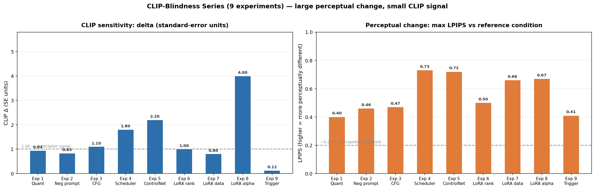
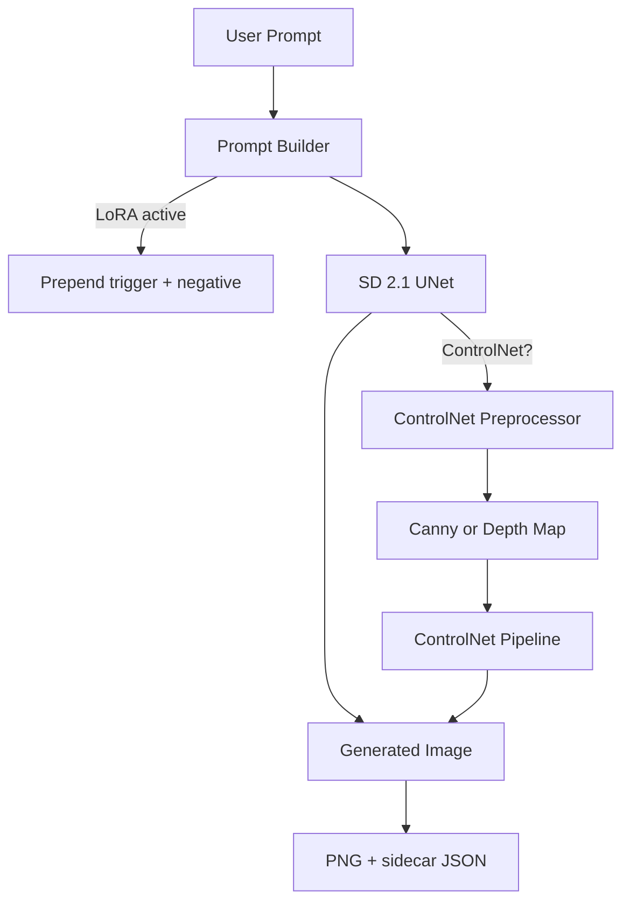

# AetherArt — Diffusion Inference on a Laptop GPU

[](https://huggingface.co/spaces/gauravgandhi2411/AetherArt)
[](https://github.com/gaurav-gandhi-2411/AetherArt)
[](LICENSE)


## What this is

A personal research project: implement modern diffusion model inference end-to-end on an 8 GB laptop GPU, understand what each piece actually costs, and measure the tradeoffs honestly. The RTX 3070 forced every architectural choice — 8 GB is enough to run SD 2.1, not enough to be casual about memory layout.

I built this to understand each component deeply — not to ship a product. The code is production-grade (CI, type annotations, test coverage, a registry that owns pipeline singletons) because those constraints force cleaner understanding of the internals.

## What this demonstrates

- [SD 2.1 inference on 8 GB VRAM](aetherart/model.py) via fp16 + model CPU offload — generation in 3.2 s on RTX 3070
- [Custom Ukiyo-e LoRA](data/lora/ukiyo-e/) — rank-8 adapter, 80 images, 2 h 8 min training, 6.4 MB; [training details](reports/lora_training_summary.md)
- [ControlNet Canny + Depth](aetherart/controlnet.py) — spatial conditioning with a 2-entry LRU pipeline cache
- [LCM + SDXL Turbo speed tiers](aetherart/lcm.py) — [4-step (0.6 s)](aetherart/lcm.py) and [1-step (3.3 s)](aetherart/sdxl_turbo.py) generation modes
- [INT8 + NF4 quantization](aetherart/quantization.py) via bitsandbytes — SD 2.1 on ≥ 4 GB GPUs; [measured results](reports/quantization_benchmark.md)
- [360-run CLIP benchmark](reports/findings.md) — 4 schedulers × 3 step counts × 30 prompts; key finding: prompt choice matters 18× more than scheduler choice

## Try it

**[Live Space (CPU architecture demo) →](https://huggingface.co/spaces/gauravgandhi2411/AetherArt)**  
The Space runs on HF's free CPU tier — generation takes ~8–15 min. It demonstrates the architecture and lets you explore the UI. For real-time GPU generation, run locally: see [CONTRIBUTING.md](CONTRIBUTING.md) for setup.

---

## Table of Contents

- [Gallery](#gallery)
- [Findings](#findings)
- [Central finding: CLIP blindness](#central-finding-clip-blindness)
- [Architecture](#architecture)
- [Models & Techniques](#models--techniques)
- [Performance](#performance)
- [Recreate from PNG](#recreate-from-png)
- [Reproducibility](#reproducibility)
- [Project Structure](#project-structure)
- [Experiments](#experiments-phase-6b)
- [What's Next](#whats-next)
- [References & Acknowledgments](#references--acknowledgments)

---

## Gallery

All generated on RTX 3070 8 GB. Each image demonstrates a different capability.

### Standard SD 2.1 — Photorealistic Composition


> *"Mount Fuji at golden hour, reflections in a perfectly still lake, foreground cherry blossom branches, traditional Japanese woodblock print fused with photorealism, ultra detailed, cinematic, masterpiece"*  
> Seed 1337 · 50 steps · DPM-Solver++ · 768×768 · fp16 · [metadata](docs/gallery/01_hero_fuji_blossom.json)

### Standard SD 2.1 — Fantasy


> *"a wise old wizard reading an ancient leather-bound book by candlelight, intricate magical symbols floating around him, warm golden light, photorealistic fantasy, ultra detailed, dramatic shadows"*  
> Seed 888 · 50 steps · DPM-Solver++ · 768×768 · fp16 · [metadata](docs/gallery/02_standard_wizard.json)

### Custom Ukiyo-e LoRA


> *"a samurai warrior in flowing silk robes against a blazing sunset, traditional ukiyo-e woodblock style, bold graphic lines, rich colors, atmospheric"*  
> Seed 1337 · 50 steps · DPM-Solver++ · 768×768 · LoRA: `ukiyo-e-lora.safetensors` (weight 1.0) · [metadata](docs/gallery/03_lora_samurai.json)
>
> Rank-8 adapter trained for 2 h on the RTX 3070. The woodblock-print rendering differs meaningfully from SD 2.1 base + style prompt alone — characteristic figure simplification, reduced palette, bold outlines.

### ControlNet — Canny Edge Conditioning


> *"an ornate ancient temple in mystical mountain mist, fantasy art, ultra detailed, atmospheric, dramatic lighting, cinematic"*  
> ControlNet: Canny · Source: [edge image](docs/gallery/04_canny_source.png) · Seed 1337 · 50 steps · 768×768 · [metadata](docs/gallery/04_canny_temple.json)

### ControlNet — Depth Conditioning


> *"a futuristic neon-lit Asian metropolis at night, cyberpunk aesthetic, rain-slicked streets reflecting holographic advertisements, ultra detailed, cinematic"*  
> ControlNet: Depth · Source: [depth image](docs/gallery/05_depth_source.png) · Seed 1337 · 50 steps · 768×768 · [metadata](docs/gallery/05_depth_cyberpunk.json)

### SDXL Turbo — 1-Step Generation


> *"an underwater city of bioluminescent coral and ancient ruins, mystical sea creatures, divine light rays, ultra detailed fantasy, epic"*  
> Model: SDXL Turbo · Steps: 1 · Seed 1337 · 512×512 · 4.0 s · [metadata](docs/gallery/06_turbo_bioluminescent.json)

---

## Findings

Prompt choice matters 18× more than scheduler choice. Across 30 prompts the CLIP score range is 0.130 (0.252–0.382); across four schedulers it's 0.007. The practical upshot: DPM-Solver++ at 20 steps matches DDIM at 50 steps within noise (Δ = 0.0015, ~4% of σ) at half the latency.

**[Full benchmark findings, methodology, and charts → reports/findings.md](reports/findings.md)**

| Chart | |
|---|---|
|  |  |

---

## Central finding: CLIP blindness

The 360-run benchmark above tested one parameter (scheduler choice) on one metric (CLIP). The finding below comes from a separate, larger experiment series — nine controlled experiments across quantization, negative prompts, CFG scale, ControlNet strength, LoRA rank, LoRA data size, LoRA alpha, and LoRA trigger words — and tests CLIP itself as a measurement tool.

Nine Phase 6b experiments varied one generation parameter at a time and measured CLIP score and LPIPS (Learned Perceptual Image Patch Similarity). The result was consistent: **CLIP stayed flat while the images changed substantially.** CLIP delta was mostly below 1 standard error across all nine experiments; LPIPS ranged 0.40–0.73.

| Panel | What it shows |
|---|---|
|  | Left: CLIP sensitivity (SE units). Right: max LPIPS. The contrast is the finding — tall orange LPIPS bars against mostly-nub blue CLIP bars. |

The one partial exception is Experiment 8 (LoRA alpha): CLIP rises +4 SE when the LoRA switches on, because the prompts explicitly name the style. But CLIP stays blind within the active range (alpha 0.5–1.25) despite LPIPS showing 0.40+ unit differences there.

**The underfitting paradox:** The clearest illustration of what CLIP actually measures. Rank-4 LoRA scored *higher* on CLIP than rank-8 (0.3384 vs 0.3337); data-20 scored higher than data-80. Underfit models produce more literal keyword matches; CLIP rewards literalness, not visual quality.

**Implication:** CLIP is valid for confirming semantic presence — whether the image contains what the prompt describes. It cannot guide parameter choices that reshape visual character: CFG above the plateau, ControlNet strength, LoRA rank, training data quality, adapter alpha. Use LPIPS or human evaluation for those.

**[Full writeup with evidence table, mechanistic explanation, and caveats → reports/clip_blindness.md](reports/clip_blindness.md)**

---

## Architecture



| Component | Model | Role |
|---|---|---|
| Base | `sd2-community/stable-diffusion-2-1` | Text-to-image diffusion |
| ControlNet (Canny) | `thibaud/controlnet-sd21-canny-diffusers` | Edge-conditioned generation |
| ControlNet (Depth) | `thibaud/controlnet-sd21-depth-diffusers` | Depth-conditioned generation |
| LoRA adapter | `data/lora/ukiyo-e/ukiyo-e-lora.safetensors` | Ukiyo-e style transfer (rank-8) |
| Scheduler | DPMSolverMultistepScheduler | Best CLIP/latency trade-off in benchmark |
| LCM mode | `LCMScheduler` (diffusers) | 4-step fast generation (5.3× speedup) |
| SDXL Turbo | `stabilityai/sdxl-turbo` | 1-step adversarial diffusion |
| Quantization | bitsandbytes (4-bit NF4 / 8-bit INT8) | Memory-efficient U-Net for ≥ 4 GB GPUs |
| Evaluator | `openai/clip-vit-base-patch32` | Prompt-image similarity scoring |

All components run on a single RTX 3070 8 GB via model CPU offload (fp16). LoRA and ControlNet pipelines share a 2-entry LRU cache keyed by (ctype, lora, alpha).

---

## Models & Techniques

### SD 2.1 — why not SDXL or SD 3.5?

SDXL needs ~10 GB VRAM for inference, more for training. My laptop has 8 GB. SD 3.5 requires more still. SD 2.1 fits cleanly in 8 GB with fp16 + attention slicing.

When Stability AI deprecated `stabilityai/stable-diffusion-2-1` in early 2026 (EU AI Act compliance), I switched to the community mirror `sd2-community/stable-diffusion-2-1`. Same weights, same diffusers API, no code change.

### LoRA — why rank 8?

Rank-8 LoRA is 6.4 MB on disk; rank-16 is 12.8 MB with marginal quality gain on small datasets. With 80 training images, rank 8 fits the data without overfitting. Loss plateaus at checkpoint-1000 and ticks up at 1500 — the classic overfitting sign.

| Parameter | Value |
|---|---|
| Base model | `sd2-community/stable-diffusion-2-1` |
| Dataset | 80 WikiArt Ukiyo-e images, trigger `ukyowood` |
| Rank | 8 |
| Steps | 1500 (checkpoint-1000 selected) |
| LR | 1e-4, fp16 mixed precision |
| Wall time | 2 h 8 min, RTX 3070 8 GB, 0 OOM events |
| Adapter size | 6.4 MB |


*Checkpoint selection. Left to right: baseline · ckpt-500 · ckpt-1000 (selected) · ckpt-1500. Loss at 1500 ticks up from 0.268 to 0.495 — overfitting onset.*


*Top: base SD 2.1 · Bottom: Ukiyo-e LoRA (alpha=1.0, trigger added)*

**Calligraphy artifact:** WikiArt source images embed calligraphy text, which the LoRA absorbed as part of the style signal. Mitigation: default negative prompt `text, watermark, calligraphy, signature, words, letters` is auto-applied whenever the Ukiyo-e adapter is active.

```bash
python scripts/train_lora.py                     # full 1500-step run
python scripts/train_lora.py --max-train-steps 5 # pre-flight smoke test
```

### ControlNet

| Mode | Model | Preprocessor |
|---|---|---|
| Canny | `thibaud/controlnet-sd21-canny-diffusers` | OpenCV Canny edge detection |
| Depth | `thibaud/controlnet-sd21-depth-diffusers` | DPT-Hybrid-MiDaS (`Intel/dpt-hybrid-midas`) |

ControlNet checkpoints must match the base model's U-Net architecture. The `thibaud/controlnet-sd21-*` family is the matching pair for SD 2.1. Using an SDXL ControlNet on an SD 2.1 pipeline fails silently — the conditioning map is ignored because the cross-attention dimensions don't match.

Combining LoRA with ControlNet required loading the LoRA directly into the ControlNet pipeline rather than the base SD 2.1 pipeline to avoid weight conflicts.

**VRAM note:** ControlNet runs on a separate pipeline (~3 GB additional). With the 2-entry LRU cache, the oldest (ctype, lora, alpha) combination is evicted when a third is needed.

### Schedulers — why four?

DDIM is the canonical baseline. DPM-Solver++ is the current Pareto-optimal choice in the diffusers literature. Euler-Ancestral and LMS fill out the comparison. DPM-Solver++ and DDIM are statistically indistinguishable at the same step count (Δ = 0.0007, smaller than 1 SE) — the real win is reaching the same CLIP score in fewer steps.

---

## Performance

### Why is this slower than commercial APIs?

Commercial services run on H100/A100 GPUs (80 GB VRAM) with TensorRT-compiled models and batched inference. A single user's request amortises across hundreds of concurrent users. Here I'm running on an RTX 3070 Laptop (8 GB, ~12× less memory bandwidth than an A100) in PyTorch eager mode with full SD 2.1 at 30 steps. The 10–15 s local generation time reflects hardware constraints, not inefficient code. On a paid Spaces GPU instance (A10G, $0.60/hr) it drops to 4–6 s.

### Speed tiers

| Mode | Steps | RTX 3070 (local) | HF CPU Space (est.) | Quality |
|------|------:|------------------|---------------------|---------|
| Standard fp16 | 30 | **3.2 s/img** | ~5–8 min | Full baseline |
| LCM fast (4-step) | 4 | **0.6 s/img — 5.3× faster** | GPU only | Moderate reduction |
| SDXL Turbo (1-step) | 1 | **3.3 s/img** — same as standard | GPU only | Lower; SDXL model (~2.6B vs 865M params) |

> **SDXL Turbo note:** On RTX 3070 (8 GB), one pass through SDXL's 2.6B-parameter U-Net takes the same wall time as 30 passes through SD 2.1's 865M-parameter U-Net. The real Turbo speedup (10–30×) shows on A100/H100.

### VRAM and quantization

4-bit NF4 uses 1382 MB — 421 MB less than fp16's 1803 MB — but slows generation from 2.7 s to 4.7 s. The 8-bit INT8 mode costs 407 MB more than fp16 under CPU offload: bitsandbytes allocates a full fp16 compute buffer for dequantization, and on 8 GB with `enable_model_cpu_offload()` that buffer costs more than the stored-weight savings recover. Quantization applies to the U-Net only; text encoder and VAE stay at fp16.

| Precision | Peak VRAM (Exp 1) | vs fp16 | Avg latency | When to use |
|-----------|------------------:|---------|-------------|-------------|
| fp16 (default) | 1803 MB | — | 2.7 s/img | 8 GB GPU — best quality |
| 8-bit INT8 | **2210 MB** | **+407 MB** | 9.6 s/img | Costs VRAM under CPU offload; gains savings only when loaded fully on-device (≥12 GB) |
| 4-bit NF4 | 1382 MB | −421 MB | 4.7 s/img | Best VRAM savings under CPU offload; pixel fidelity loss is substantial (LPIPS = 0.40 vs fp16) |

> VRAM numbers are from [Experiment 1](reports/experiments/exp1_quantization_quality/findings.md) (40 images, RTX 3070, model CPU offload). Latency is from an earlier standalone benchmark (warm model, isolated pipeline call) — the speed tiers table's 3.2 s/img for fp16 includes CPU offload switching overhead across the full generation stack.

> LCM and quantization are independent axes — combine them for speed *and* VRAM savings.

### VRAM breakdown

```
SD 2.1 U-Net (fp16):        1803 MB peak  (Exp 1, RTX 3070, model CPU offload)
SD 2.1 U-Net (8-bit INT8):  2210 MB peak  (+407 MB vs fp16 under CPU offload; compute buffer cost)
SD 2.1 U-Net (4-bit NF4):   1382 MB peak  (−421 MB vs fp16; 4-bit compression survives compute buffer)
ControlNet pipeline:         ~3000 MB additional (separate pipeline object)
LoRA adapter:                   6.4 MB (negligible)
SDXL Turbo:                  ~6000 MB peak (separate SDXL-architecture model)
Total worst case (SD+CN fp16): ~4800 MB — fits in 8 GB with margin
```

---

## Recreate from PNG

Every image AetherArt generates embeds its full generation parameters as PNG tEXt chunks and a sidecar `.json` file. The **Recreate from PNG** tab accepts any prior output and restores the exact settings.

| Field | Description |
|---|---|
| `prompt` / `negative_prompt` | Exact text used |
| `seed` | Full integer seed — reproduced exactly on identical hardware |
| `steps`, `guidance_scale`, `scheduler` | All sampler settings |
| `width`, `height` | Resolution |
| `lora`, `lora_weight` | LoRA adapter name and alpha (if active) |
| `controlnet` | Conditioning type (if active) |
| `git_commit` | Short SHA at generation time |
| `vram_peak_mb`, `generation_time_seconds` | Performance metadata |

PNG tEXt chunks survive most image hosts that don't strip metadata. A generated image shared anywhere that preserves metadata is self-documenting — drag it back into the UI months later and reproduce it. The git commit hash lets you `git checkout <sha>` to the exact codebase version that produced a given image.

Implementation: [`aetherart/metadata.py`](aetherart/metadata.py).

---

## Reproducibility

Key artifacts and the commands that produce them:

| Artifact | Command | Hardware | Time |
|---|---|---|---|
| 360-run CLIP benchmark | `python scripts/eval.py` | RTX 3070 8 GB | ~4 h |
| Ukiyo-e LoRA adapter | `python scripts/train_lora.py` | RTX 3070 8 GB | ~2 h |
| Quantization benchmark | `python scripts/benchmark_quantization.py` | RTX 3070 8 GB | ~30 min |
| Benchmark charts | `python scripts/generate_benchmark_charts.py` | CPU only | < 1 min |

**Known limitations:**
- `eval.py` requires the SD 2.1 model cached locally (~5 GB). First run downloads it.
- `train_lora.py` requires WikiArt data pre-downloaded via `scripts/prepare_lora_dataset.py`.
- Results are deterministic for the same hardware. Different GPU models or driver versions may produce different pixel values from the same seed.

---

## Project Structure

```
AetherArt/
├── app.py                                  # Gradio UI — generation, ControlNet, LoRA, speed/memory modes
├── aetherart/
│   ├── model.py                            # SD 2.1 pipeline + VRAM optimisations
│   ├── controlnet.py                       # ControlNet preprocessing + LRU-cached pipelines
│   ├── lora.py                             # LoRA registry, load/unload
│   ├── lcm.py                              # LCM scheduler switching (4-step fast generation)
│   ├── sdxl_turbo.py                       # SDXL Turbo pipeline (1-step adversarial diffusion)
│   ├── quantization.py                     # 4-bit NF4 / 8-bit INT8 U-Net via bitsandbytes
│   ├── metadata.py                         # PNG tEXt + sidecar JSON
│   ├── registry.py                         # ModelRegistry — pipeline singleton owner; fixes two latent bugs
│   ├── gpu_hygiene.py                      # cleanup_gpu() with atexit registration
│   ├── visualization/                      # ChartCanvas, palette constants
│   └── config.py                           # env-driven config (model IDs, defaults)
├── data/lora/ukiyo-e/
│   ├── ukiyo-e-lora.safetensors            # selected adapter (6.4 MB, checkpoint-1000)
│   └── metadata.jsonl                      # 80 captions with ukyowood trigger token
├── scripts/
│   ├── eval.py                             # 360-run CLIP benchmark harness
│   ├── train_lora.py                       # LoRA training wrapper (accelerate launch)
│   ├── generate_benchmark_charts.py        # ChartCanvas-based chart generation
│   ├── generate_clip_blindness_chart.py    # CLIP-blindness two-panel summary chart
│   ├── benchmark_quantization.py           # fp16 vs 8-bit vs 4-bit VRAM + CLIP + latency
│   └── prepare_lora_dataset.py             # WikiArt dataset prep + caption generation
├── docs/
│   ├── gallery/                            # Hand-picked outputs (1 per capability) with JSON sidecars
│   └── samples/                            # Pre-generated sample matrix across speed/memory tiers
├── reports/
│   ├── findings.md                         # Benchmark narrative + charts
│   ├── eval_charts/                        # pareto_scatter.png, variance_decomposition.png
│   ├── lora_comparison_gallery.png
│   ├── lora_fuji_progression.png
│   ├── lora_training_summary.md
│   └── quantization_benchmark.md
├── spaces/
│   └── README.md                           # HF Space version (with YAML frontmatter)
├── tests/                                  # pytest suite — 76 tests, 41% coverage (visualization package at 0%; ~56% excluding it)
├── CONTRIBUTING.md
├── CHANGELOG.md
└── requirements.txt
```

---

## Experiments (Phase 6b)

Nine controlled experiments examining generation parameters. The cross-cutting finding: **CLIP measures semantic alignment reliably but is structurally blind to parameters that reshape visual character without eliminating prompt-relevant content.** LPIPS was added as a complementary perceptual metric across all experiments.

| Experiment | Headline result |
|---|---|
| [Quantization quality](reports/experiments/exp1_quantization_quality/findings.md) (fp16 / INT8 / NF4) | All three within 1 SE on CLIP. NF4 vs fp16 LPIPS = 0.40 — perceptually large, CLIP-invisible. |
| [Negative prompt impact](reports/experiments/exp2_negative_prompt/findings.md) | CLIP delta +0.003 (within noise). LPIPS = 0.46 between conditions. |
| [CFG scale sweep](reports/experiments/exp3_cfg_sweep/findings.md) (CFG 1–15) | CLIP plateaus at CFG=5, flat to CFG=15. LPIPS vs CFG=7 reaches 0.47 at CFG=15 — comparable to NF4 damage. |
| [Scheduler visual comparison](reports/experiments/exp4_scheduler_visual/findings.md) | Two LPIPS clusters: EulerA (stochastic) 0.72–0.73 vs deterministic (DDIM/DPM/LMS) 0.31–0.48. CLIP range borderline. |
| [ControlNet strength sweep](reports/experiments/exp5_controlnet_strength/findings.md) (0.0–1.5) | CLIP flat 0.0–1.0. LPIPS V-shape: no conditioning = 0.72 (same as EulerA cluster); over-conditioning = 0.32. |
| [LoRA rank ablation](reports/experiments/exp6_lora_rank/findings.md) (rank 4/8/16, Exp 6) | CLIP spread <1 SE — rank-blind. LPIPS 0.45–0.50 between ranks. Rank-4 CLIP > rank-8 (underfitting paradox). File size: 3.4/6.7/13.3 MB. |
| [LoRA data size ablation](reports/experiments/exp7_lora_data_size/findings.md) (20/40/80 img, Exp 7) | CLIP spread <1 SE — data-volume-blind. LPIPS vs 80-img: 0.66 (20 img), 0.55 (40 img). All checkpoints 6.7 MB. |
| [LoRA style scale sweep](reports/experiments/exp8_lora_alpha/findings.md) (alpha 0.0–1.5, Exp 8) | CLIP rises +4 SE from no-LoRA to active-LoRA, then flat. LPIPS separates alpha=0.5 from alpha=1.5 (CLIP cannot). |
| [LoRA trigger token sensitivity](reports/experiments/exp9_lora_trigger/findings.md) (Exp 9) | CLIP delta −0.0008 (pure noise). LPIPS = 0.41 — trigger meaningfully redirects LoRA; CLIP is blind to it. |

Full analysis: [`reports/findings.md`](reports/findings.md)

---

## What's Next

- **LoRA on cleaner data** — the calligraphy artifact is the LoRA's main weakness. The fix is curation, not architecture. Iterating over multiple training runs needs ~10–20 hours of A10G time.
- **Multi-LoRA composition** — blending Ukiyo-e + sketch at inference is architecturally straightforward. The blocker is curating training data for a second style.
- **DreamBooth for subject personalisation** — full fine-tuning needs ~16 GB VRAM and 30–60 min per subject. Out of reach on the RTX 3070.
- **TensorRT compilation** — 3–5× additional speedup. Only worth pursuing with consistent production traffic to amortise the build time.
- **Distillation** — whether a distilled SD 2.1 can run on 4 GB GPU is an interesting question. Needs a teacher inference budget not available on free GPU tiers.

---

## Project documentation

- **[reports/clip_blindness.md](reports/clip_blindness.md)** — Cross-experiment CLIP-blindness writeup: evidence table, mechanistic explanation, the underfitting paradox, practical implications, caveats.
- **[reports/what_didnt_work.md](reports/what_didnt_work.md)** — Honest account of bugs, abandoned approaches, and surprises, including the Phase 6b experiment substitution incident.
- **[docs/lab_notebook.md](docs/lab_notebook.md)** — Dated research log: decisions, surprises, and what the data showed vs what was expected.
- **[reports/findings.md](reports/findings.md)** — Main benchmark narrative (360-run CLIP benchmark + Phase 6b overview).
- **[CHANGELOG.md](CHANGELOG.md)** — Phased project history.

---

## References & Acknowledgments

- [Latent Diffusion Models](https://arxiv.org/abs/2112.10752) — Rombach et al., CVPR 2022
- [Latent Consistency Models](https://arxiv.org/abs/2310.04378) — Luo et al., 2023
- [SDXL Turbo: Adversarial Diffusion Distillation](https://stability.ai/research/adversarial-diffusion-distillation) — Stability AI, 2023
- [LoRA: Low-Rank Adaptation](https://arxiv.org/abs/2106.09685) — Hu et al., ICLR 2022
- [ControlNet](https://arxiv.org/abs/2302.05543) — Zhang et al., ICCV 2023
- [PartiPrompts](https://github.com/google-research/parti) — Google Research eval benchmark
- [bitsandbytes](https://github.com/TimDettmers/bitsandbytes) — Tim Dettmers et al.

For BibTeX entries: [CITATIONS.bib](CITATIONS.bib).

**Models used:**
- SD 2.1 weights: [sd2-community/stable-diffusion-2-1](https://huggingface.co/sd2-community/stable-diffusion-2-1)
- ControlNet checkpoints: [thibaud's SD 2.1 ControlNet collection](https://huggingface.co/thibaud)
- WikiArt training data: [huggan/wikiart](https://huggingface.co/datasets/huggan/wikiart)
- Hugging Face [diffusers](https://github.com/huggingface/diffusers) library and training scripts
