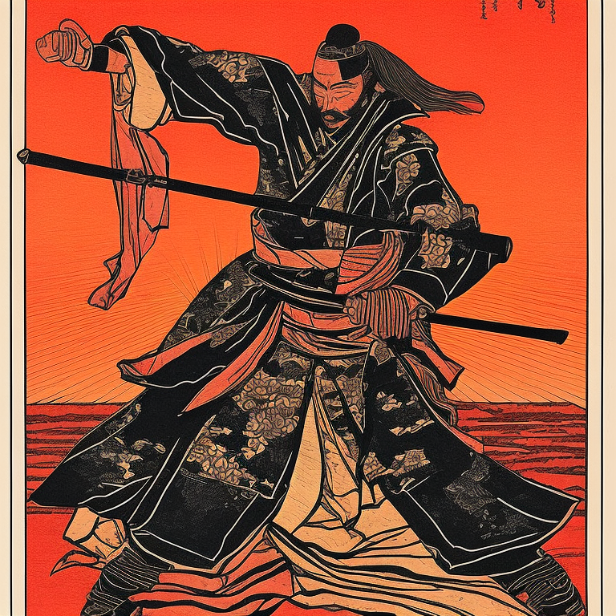
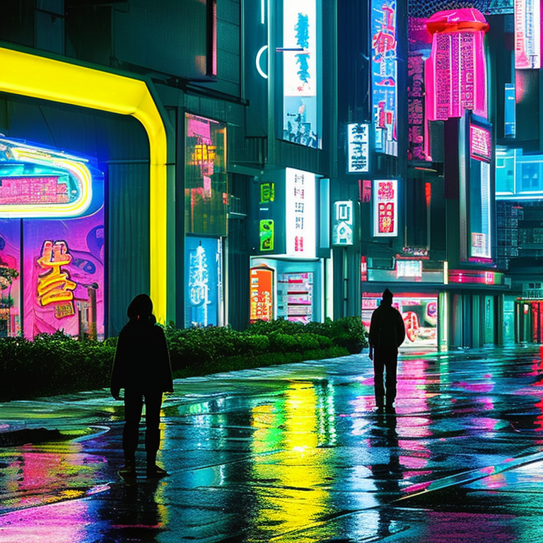
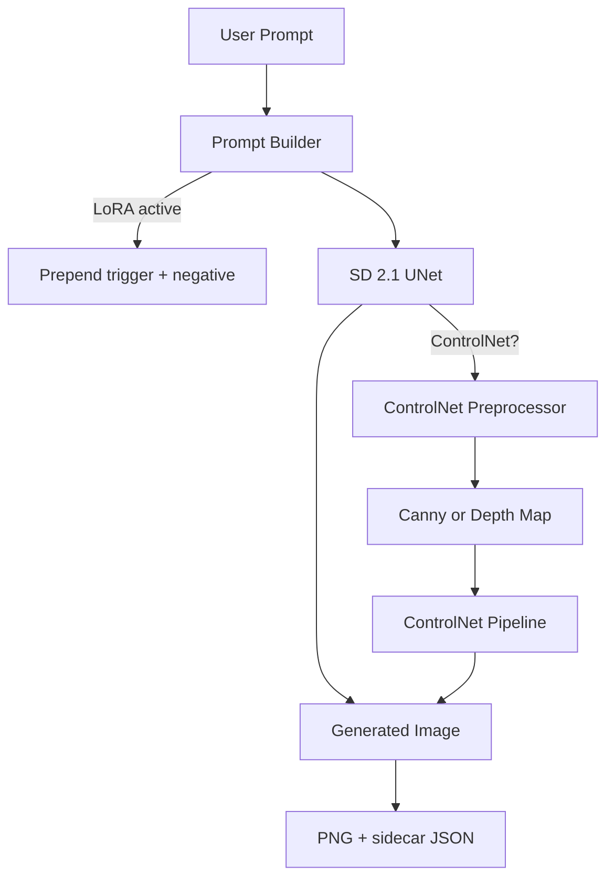
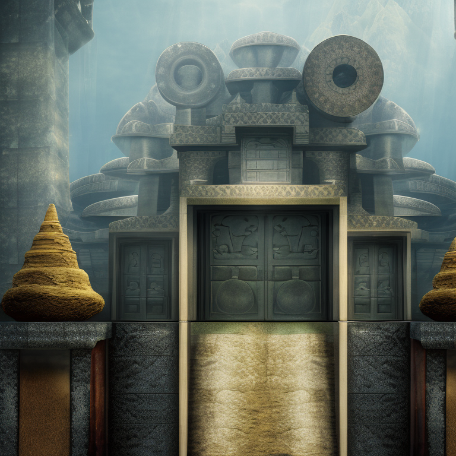
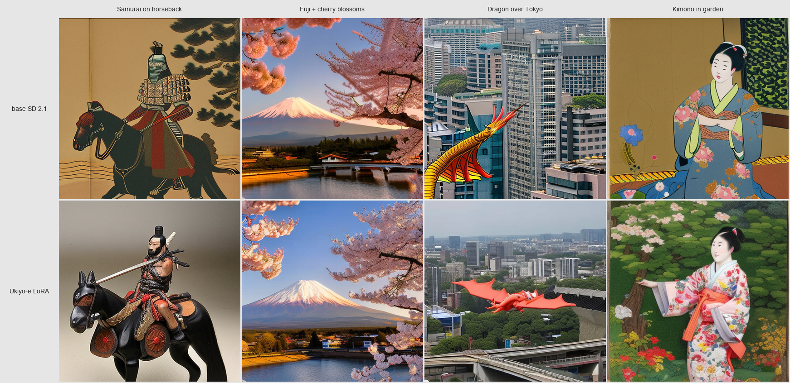

# AetherArt — Diffusion Inference on a Laptop GPU

[](https://huggingface.co/spaces/gauravgandhi2411/AetherArt)
[](https://github.com/gaurav-gandhi-2411/AetherArt)
[](LICENSE)

<table>
  <tr>
    <td></td>
    <td></td>
  </tr>
  <tr>
    <td></td>
    <td></td>
  </tr>
</table>

> I built this to see what it takes to run modern diffusion models on a laptop GPU. The RTX 3070 has 8 GB of VRAM, which forced every architectural choice. Here's what I wired together: **LCM 4-step (5.3×)**, **SDXL Turbo (1-step)**, **4-bit/8-bit quantization**, **Ukiyo-e LoRA**, and **ControlNet** — all benchmarked on that same RTX 3070.

**What this demonstrates:**

- [SD 2.1 inference on 8 GB VRAM](aetherart/model.py) via fp16 + model CPU offload — generation in 3.2 s on RTX 3070
- [Custom Ukiyo-e LoRA](data/lora/ukiyo-e/) — rank-8 adapter, 80 images, 2 h 8 min training, 6.4 MB; [training details](reports/lora_training_summary.md)
- [ControlNet Canny + Depth](aetherart/controlnet.py) — spatial conditioning with a 2-entry LRU pipeline cache
- [LCM + SDXL Turbo speed tiers](aetherart/lcm.py) — [4-step (0.6 s)](aetherart/lcm.py) and [1-step (3.3 s)](aetherart/sdxl_turbo.py) generation modes
- [INT8 + NF4 quantization](aetherart/quantization.py) via bitsandbytes — SD 2.1 on ≥ 4 GB GPUs; [measured results](reports/quantization_benchmark.md)
- [360-run CLIP benchmark](reports/findings.md) — 4 schedulers × 3 step counts × 30 prompts; key finding: prompt choice matters 18× more than scheduler choice

<!-- Demo GIF placeholder — record following docs/RECORDING_GUIDE.md and replace this block:

Target: < 5 MB, 12–15 fps, 720p, showing Standard / LCM / Turbo tiers back-to-back
-->

> **Demo:** No GIF yet — requires local RTX 3070 recording (see [`docs/RECORDING_GUIDE.md`](docs/RECORDING_GUIDE.md)).  
> The gallery below shows what the GPU version produces. The [live Space](https://huggingface.co/spaces/gauravgandhi2411/AetherArt) runs on CPU (~8–15 min/image) and is an architecture demo, not a speed demo.

**[Live Space (CPU architecture demo) →](https://huggingface.co/spaces/gauravgandhi2411/AetherArt)**  
*Runs on HF free CPU tier as an architecture demo — generation takes ~8–15 min. Clone and run locally for real-time GPU inference.*

---

## Table of Contents

- [Why This Project Exists](#why-this-project-exists)
- [Architecture](#architecture)
- [Models Used (and Why)](#models-used-and-why)
- [Performance Trade-offs](#performance-trade-offs)
- [Gallery](#gallery)
- [Sample Outputs](#sample-outputs)
- [LoRA Fine-tuning](#lora-fine-tuning)
- [ControlNet Conditioning](#controlnet-conditioning)
- [Recreate from PNG](#recreate-from-png)
- [Benchmark Results](#benchmark-results)
- [Quick Start](#quick-start)
- [Project Structure](#project-structure)
- [Why CPU on the Live Space?](#why-cpu-on-the-live-space)
- [Free-Tier Limitations](#free-tier-limitations)
- [What's Next (if I had more compute)](#whats-next-if-i-had-more-compute)
- [References & Inspiration](#references--inspiration)
- [Acknowledgments](#acknowledgments)

---

## Why This Project Exists

I wanted to deeply understand modern image generation by building one end-to-end on consumer hardware — not just "use the API" but implement the pieces so I know what each one does:

- The base diffusion model and its scheduler trade-offs
- LoRA — how to actually fine-tune the U-Net's attention layers on a small dataset without an A100
- ControlNet — how spatial conditioning interacts with the diffusion process
- Evaluation methodology — how to measure that any of this actually improves anything

This README documents the engineering decisions I made, including the ones that didn't work.

---

## Architecture



| Component | Model | Role |
|---|---|---|
| Base | `sd2-community/stable-diffusion-2-1` | Text-to-image diffusion |
| ControlNet (Canny) | `thibaud/controlnet-sd21-canny-diffusers` | Edge-conditioned generation |
| ControlNet (Depth) | `thibaud/controlnet-sd21-depth-diffusers` | Depth-conditioned generation |
| LoRA adapter | `data/lora/ukiyo-e/ukiyo-e-lora.safetensors` | Ukiyo-e style transfer (rank-8) |
| Scheduler | DPMSolverMultistepScheduler | Best CLIP/latency trade-off in benchmark |
| LCM mode | `LCMScheduler` (diffusers) | 4-step fast generation (5.3× speedup) |
| SDXL Turbo | `stabilityai/sdxl-turbo` | 1-step adversarial diffusion (~30× speedup) |
| Quantization | bitsandbytes (4-bit NF4 / 8-bit INT8) | Memory-efficient U-Net for ≥ 4 GB GPUs |
| Evaluator | `openai/clip-vit-base-patch32` | Prompt-image similarity scoring |

I run all components on a single RTX 3070 8 GB via model CPU offload (fp16). LoRA and ControlNet pipelines share a 2-entry LRU cache to manage the ~3 GB per-pipeline VRAM footprint.

---

## Models Used (and Why)

### Why SD 2.1 and not SDXL or SD 3.5?

SDXL needs ~10 GB VRAM for inference, more for training. My laptop has 8 GB on the RTX 3070. SD 3.5 has higher requirements still. SD 2.1 fits cleanly in 8 GB with fp16 + attention slicing.

When Stability AI deprecated `stabilityai/stable-diffusion-2-1` in early 2026 (EU AI Act compliance), I switched to the community-maintained `sd2-community/stable-diffusion-2-1` mirror. Same weights, same diffusers API, no breaking change to any downstream code.

### Why ControlNet 2.1 and not the SDXL versions?

ControlNet checkpoints must match the base model's U-Net architecture and resolution. The `thibaud/controlnet-sd21-*` family is the matching pair for SD 2.1. Using an SDXL ControlNet on an SD 2.1 pipeline fails silently — the conditioning map is ignored because the cross-attention dimensions don't match.

### Why LoRA at rank 8?

Rank-8 LoRA = 6.4 MB on disk. Rank-16 = 12.8 MB, with marginal quality gain on small datasets. With 80 training images, rank 8 is sufficient without overfitting. The loss curve confirms this — loss plateaus at checkpoint-1000 and ticks up at 1500, which is the classic sign the model has memorised the training set.

### Why these four schedulers?

DDIM is the canonical baseline. DPM-Solver++ is the current Pareto-optimal choice in the diffusers literature. Euler-Ancestral and LMS fill out the comparison set. The benchmark section below has the numbers; DPM-Solver++ and DDIM are statistically indistinguishable at the same step count (Δ = 0.0007, smaller than 1 SE) — the real win is reaching the same CLIP score in fewer steps.

---

## Performance Trade-offs

### Why does this take 30-60 seconds when commercial APIs respond in ~5 seconds?

Commercial text-to-image services run on:
- **H100/A100 GPUs** (80 GB VRAM) purpose-built for batch inference
- **TensorRT-compiled models** — CUDA kernel fusion gives a 3–5× speedup over vanilla PyTorch
- **Distilled models** (SDXL Turbo, FLUX schnell) — 1–4 step generation vs 30 steps
- **Batched inference** — fixed per-request overhead amortised over hundreds of concurrent users

I'm running on:
- **RTX 3070 Laptop 8 GB** — ~12× less memory bandwidth than an A100
- **PyTorch eager mode** — no TensorRT, no kernel fusion
- **Full SD 2.1** — not distilled, 30 steps to convergence
- **fp16 with CPU offload** — model layers swap between GPU and CPU during inference

The 10–15 s local generation time reflects hardware constraints, not bad code. With a paid Spaces GPU instance (A10G, $0.60/hr) it drops to 4–6 s.

### Generation speed tiers

I added three speed modes to actually feel the trade-offs rather than just read about them. Swapping to the LCM scheduler dropped inference from 3.2 s to 0.6 s — about 5.3×. The catch is that LCM-LoRA doesn't exist for SD 2.1, so I'm using scheduler-only LCM, which trades some quality for speed. All tiers are selectable in the UI without restarting the server.

| Mode | Steps | RTX 3070 (local) | HF CPU Space (est.) | Quality |
|------|------:|------------------|---------------------|---------|
| Standard fp16 | 30 | **3.2 s/img** | ~5–8 min | Full baseline |
| LCM fast (4-step) | 4 | **0.6 s/img — 5.3× faster** | GPU only | Moderate reduction |
| SDXL Turbo (1-step) | 1 | **3.3 s/img** — same as standard | GPU only | Lower; SDXL model (~2.6B vs 865M params) |

> **SDXL Turbo note**: On RTX 3070 (8 GB), one pass through SDXL's 2.6B-parameter U-Net takes the same wall time as 30 passes through SD 2.1's 865M-parameter U-Net. Real Turbo speedup (10–30×) shows on A100/H100 with ~6.7 GB VRAM for the SDXL model.

### Memory / VRAM trade-offs (quantization)

I added three memory modes because I wanted to feel the actual trade-offs, not just read about them. What surprised me: 4-bit NF4 uses 2761 MB — only 336 MB less than fp16's 3097 MB — but slows generation from 2.7 s to 4.7 s. The 8-bit INT8 mode saves 887 MB of VRAM but at 9.6 s it is 3.6× slower than fp16. The compute cost of dequantization at inference time exceeds the bandwidth savings on a laptop GPU — that kind of detail isn't in any blog post I read. Quantization applies to the U-Net only; text encoder and VAE stay at fp16.

| Precision | Peak VRAM (measured) | vs fp16 | Avg latency | When to use |
|-----------|---------------------:|---------|-------------|-------------|
| fp16 (default) | 3097 MB | — | 3.2 s/img | 8 GB GPU — best quality |
| 8-bit INT8 | **2210 MB** | −887 MB | 9.6 s/img | 4–6 GB GPU — best VRAM savings |
| 4-bit NF4 | 2761 MB | −336 MB | 4.7 s/img | Smallest stored weights; inference peak inflated by compute buffer |

> LCM and quantization are independent axes — combine them for speed *and* VRAM savings simultaneously.


### VRAM breakdown

```
SD 2.1 U-Net (fp16):        3097 MB peak  (measured, RTX 3070, 30 steps, model CPU offload)
SD 2.1 U-Net (8-bit INT8):  2210 MB peak  (best VRAM savings; 3.5× slower due to dequant)
SD 2.1 U-Net (4-bit NF4):   2761 MB peak  (bitsandbytes compute buffer inflates inference peak)
ControlNet pipeline:         ~3000 MB additional (separate pipeline object)
LoRA adapter:                   6.4 MB (negligible)
SDXL Turbo:                  ~6000 MB peak (separate SDXL-architecture model, no LoRA/CN)
Total worst case (SD+CN fp16): ~6100 MB — fits in 8 GB with margin
```

---

## Gallery

A small selection of outputs across AetherArt's four major capabilities. All generated locally on an RTX 3070 8 GB. Generation parameters are in the metadata sidecar files.

### Hero — Photorealistic SD 2.1


> *"Mount Fuji at golden hour, reflections in a perfectly still lake, foreground cherry blossom branches, traditional Japanese woodblock print fused with photorealism, ultra detailed, cinematic, masterpiece"*  
> Seed 1337 · 50 steps · DPM-Solver++ · 768×768 · fp16 · 23.7s · [metadata](docs/gallery/01_hero_fuji_blossom.json)

### Standard SD 2.1 — Fantasy Composition


> *"a wise old wizard reading an ancient leather-bound book by candlelight, intricate magical symbols floating around him, warm golden light, photorealistic fantasy, ultra detailed, dramatic shadows"*  
> Seed 888 · 50 steps · DPM-Solver++ · 768×768 · fp16 · 24.0s · [metadata](docs/gallery/02_standard_wizard.json)

### Custom Ukiyo-e LoRA — Fine-Tuned on RTX 3070


> *"a samurai warrior in flowing silk robes against a blazing sunset, traditional ukiyo-e woodblock style, bold graphic lines, rich colors, atmospheric"*  
> Seed 1337 · 50 steps · DPM-Solver++ · 768×768 · fp16 · LoRA: `ukiyo-e-lora.safetensors` (weight 1.0) · [metadata](docs/gallery/03_lora_samurai.json)
>
> Trained for 2 hours on the RTX 3070 with [`scripts/train_lora.py`](scripts/train_lora.py). The LoRA produces distinct woodblock-print outputs — characteristic figure rendering, reduced palette, bold outlines — that differ meaningfully from SD 2.1 base + style prompt alone. See the [LoRA Fine-tuning](#lora-fine-tuning) section for a side-by-side comparison.

### ControlNet — Canny Edge Conditioning



> *"an ornate ancient temple in mystical mountain mist, fantasy art, ultra detailed, atmospheric, dramatic lighting, cinematic"*  
> ControlNet: Canny · Source: [edge image](docs/gallery/04_canny_source.png) · Seed 1337 · 50 steps · 768×768 · [metadata](docs/gallery/04_canny_temple.json)

### ControlNet — Depth Conditioning


> *"a futuristic neon-lit Asian metropolis at night, cyberpunk aesthetic, rain-slicked streets reflecting holographic advertisements, ultra detailed, cinematic"*  
> ControlNet: Depth · Source: [depth image](docs/gallery/05_depth_source.png) · Seed 1337 · 50 steps · 768×768 · [metadata](docs/gallery/05_depth_cyberpunk.json)

### SDXL Turbo — 1-Step Adversarial Generation


> *"an underwater city of bioluminescent coral and ancient ruins, mystical sea creatures, divine light rays, ultra detailed fantasy, epic"*  
> Model: SDXL Turbo · Steps: 1 · Seed 1337 · 512×512 · 4.0s · [metadata](docs/gallery/06_turbo_bioluminescent.json)

---

## Sample Outputs

Pre-generated on RTX 3070 8 GB, seed 42, 512×512. Visible in the **Sample Outputs** tab of the live Space.

| Tier | RTX 3070 | VRAM |
|---|---|---|
| Standard fp16 | 3.2–3.7 s/img | ~3.1 GB |
| SDXL Turbo | 3.3 s/img | ~6.0 GB |
| Ukiyo-e LoRA | 3.5–4.0 s/img | ~3.5 GB |
| ControlNet Canny | 4–5 s/img | ~5.8 GB |
| ControlNet Depth | 4–5 s/img | ~5.8 GB |
| 8-bit INT8 | 9–14 s/img | **2.2 GB** |
| 4-bit NF4 | 4.7 s/img | 2.8 GB |

Sample images and sidecar metadata: `docs/samples/`. Run `python scripts/generate_samples.py` locally to regenerate.

---

## LoRA Fine-tuning

I fine-tuned a rank-8 LoRA adapter on 80 WikiArt Ukiyo-e images using the diffusers `train_text_to_image_lora.py` script. The adapter modifies the U-Net's self- and cross-attention projection weights, leaving the rest of the model frozen.

| Parameter | Value |
|---|---|
| Base model | `sd2-community/stable-diffusion-2-1` |
| Dataset | 80 WikiArt Ukiyo-e images, trigger `ukyowood` |
| Rank | 8 |
| Steps | 1500 (checkpoint-1000 selected) |
| LR | 1e-4, mixed precision fp16 |
| Wall time | 2 h 8 min, RTX 3070 8 GB, 0 OOM events |
| Adapter size | 6.4 MB |

### Checkpoint selection


*Left to right: baseline · ckpt-500 · ckpt-1000 (selected) · ckpt-1500 · Prompt: "ukyowood ukiyo-e print of Mount Fuji at sunset"*

I picked checkpoint-1000 over 1250 and 1500 for its warmer amber palette matching Hokusai's sunset compositions. Loss at 1500 ticks up from 0.268 (at 1250) to 0.495, indicating overfitting onset.

### Base SD 2.1 vs Ukiyo-e LoRA


*Top: base SD 2.1 · Bottom: Ukiyo-e LoRA (alpha=1.0, trigger added)*

### Known limitation: calligraphy artifact

Several WikiArt source images contain embedded calligraphy text. The LoRA absorbed this as part of the style signal. Mitigation at inference time: apply negative prompt `text, watermark, calligraphy, signature, words, letters`. This is set as the default negative when the Ukiyo-e adapter is active in the UI.

### Usage

Enable the **LoRA Style** accordion in the UI, select `ukiyo-e`, and adjust alpha (1.0 = full strength, >1 = exaggerated, <1 = subtle blend). Trigger token and negative prompt are added automatically.

```bash
python scripts/train_lora.py                     # full 1500-step run
python scripts/train_lora.py --max-train-steps 5 # pre-flight smoke test
```

See `reports/lora_training_summary.md` for the full training log, loss curve, and checkpoint rationale.

---

## ControlNet Conditioning

I wired in Canny and Depth conditioning via SD 2.1-compatible ControlNet models. One thing that took work: getting LoRA and ControlNet to combine — I load the LoRA directly into the ControlNet pipeline rather than the base SD 2.1 pipeline, which avoids weight conflicts.

| Mode | Model | Preprocessor |
|---|---|---|
| Canny | `thibaud/controlnet-sd21-canny-diffusers` | OpenCV Canny edge detection |
| Depth | `thibaud/controlnet-sd21-depth-diffusers` | DPT-Hybrid-MiDaS (`Intel/dpt-hybrid-midas`) |

Upload a reference image in the **ControlNet** accordion, choose Canny or Depth, and the control map is computed automatically. Use **Preview Control Map** to inspect the extracted edges or depth map before generating.

**VRAM note:** ControlNet runs on a separate pipeline (~3 GB additional). With the 2-entry LRU cache, the oldest (ctype, lora, alpha) combination is evicted when a third is needed.

---

## Recreate from PNG

Every image AetherArt generates is saved with its full generation parameters embedded as PNG tEXt chunks and a sidecar `.json` file. The **Recreate from PNG** tab accepts any prior output and restores the exact settings used to produce it.

**What's embedded:**

| Field | Description |
|---|---|
| `prompt` / `negative_prompt` | Exact text used |
| `seed` | Full integer seed — reproduced exactly if hardware is identical |
| `steps`, `guidance_scale`, `scheduler` | All sampler settings |
| `width`, `height` | Resolution |
| `lora`, `lora_weight` | LoRA adapter name and alpha (if active) |
| `controlnet` | Conditioning type (if active) |
| `git_commit` | Short SHA at generation time — links output to the codebase version |
| `vram_peak_mb`, `generation_time_seconds` | Performance metadata |

**Why it matters:** PNG tEXt chunks survive most image hosts that don't strip metadata. A generated image shared anywhere that preserves metadata is self-documenting — you can drag it back into the UI months later and reproduce the output. This is useful for debugging (which settings produced an artifact?), for fine-tuning dataset curation (what were the exact parameters for this training image?), and for honest portfolio work (provenance is embedded, not claimed separately).

The implementation is in [`aetherart/metadata.py`](aetherart/metadata.py). The git commit hash is included so you can `git checkout <sha>` to the exact codebase version that produced a given image — even if the model defaults have changed since.

---

## Benchmark Results

I evaluated against a 30-prompt PartiPrompts subset spanning 11 categories. Metric: CLIP score (`openai/clip-vit-base-patch32`). 360 generations: 4 schedulers × 3 step counts × 30 prompts, seed = 42, RTX 3070 8 GB.

**[→ Full findings and analysis: `reports/findings.md`](reports/findings.md)**

### Scheduler comparison

| Scheduler | Avg CLIP | Latency @ 20st | Latency @ 30st | Latency @ 50st | Verdict |
|---|---|---|---|---|---|
| **DPM-Solver++** | **0.3177** | 8.2 s | 10.8 s | 15.6 s | **Recommended default** |
| DDIM | 0.3170 | 8.3 s | 10.7 s | 15.6 s | Tied for top quality |
| LMS | 0.3117 | 8.1 s | 10.6 s | 15.3 s | Higher variance |
| Euler-Ancestral | 0.3106 | 8.2 s | 10.4 s | 15.2 s | Slightly lower quality |

### Key findings

- **Prompt choice matters 18× more than scheduler choice** — prompt spread (0.130) dwarfs scheduler spread (0.007)
- **DPM@20 steps matches DDIM@50 steps within noise** (Δ=0.0015, ~4% of σ) at half the latency — use DPM@20 for throughput
- **30 steps is the sweet spot** — 20→50 steps shifts CLIP by < 0.002 while increasing latency 89%
- **VRAM is flat at 4.50 GB** across all 360 runs — model CPU offload is the binding constraint, not scheduler

| Chart | |
|---|---|
|  |  |

```bash
python scripts/eval.py                                                           # full 360-run benchmark
python scripts/eval.py --prompts-subset pp_002 --schedulers DPM --steps 30     # smoke test
```

---

## Quick Start

```bash
git clone https://github.com/gaurav-gandhi-2411/AetherArt.git
cd AetherArt

conda create -n aetherart python=3.10 -y
conda activate aetherart
pip install -r requirements.txt

# GPU torch (CUDA 12.4) — skip for CPU-only
pip install torch --index-url https://download.pytorch.org/whl/cu124

python app.py
# → http://localhost:7860
```

Set `USE_HF_INFERENCE=1` to route generation through the Hugging Face Inference API instead of loading models locally.

---

## Project Structure

```
AetherArt/
├── app.py                                  # Gradio UI — generation, ControlNet, LoRA, speed/memory modes
├── aetherart/
│   ├── model.py                            # SD 2.1 / SDXL pipeline + VRAM optimisations
│   ├── controlnet.py                       # ControlNet preprocessing + LRU-cached pipelines
│   ├── lora.py                             # LoRA registry, load/unload helpers
│   ├── lcm.py                              # LCM scheduler switching (4-step fast generation)
│   ├── sdxl_turbo.py                       # SDXL Turbo pipeline (1-step adversarial diffusion)
│   ├── quantization.py                     # 4-bit NF4 / 8-bit INT8 U-Net via bitsandbytes
│   ├── metadata.py                         # PNG tEXt + sidecar JSON
│   └── config.py                           # env-driven config (model IDs, defaults)
├── data/lora/ukiyo-e/
│   ├── ukiyo-e-lora.safetensors            # selected adapter (6.4 MB, checkpoint-1000)
│   └── metadata.jsonl                      # 80 captions with ukyowood trigger token
├── scripts/
│   ├── eval.py                             # 360-run CLIP benchmark harness
│   ├── train_lora.py                       # LoRA training wrapper (accelerate launch)
│   ├── generate_hero_image.py              # hero image generation script
│   ├── benchmark_quantization.py           # fp16 vs 8-bit vs 4-bit VRAM + CLIP + latency
│   ├── compare_lora_checkpoints.py         # 6×6 checkpoint comparison grid
│   ├── build_lora_comparison_gallery.py    # base vs LoRA comparison gallery
│   └── prepare_lora_dataset.py             # WikiArt dataset prep + caption generation
├── docs/
│   ├── gallery/                            # Hand-picked outputs (1 per capability) with JSON sidecars
│   └── samples/                            # Pre-generated sample matrix across speed/memory tiers
├── reports/
│   ├── eval_charts/                        # 4 benchmark PNGs
│   ├── lora_comparison_gallery.png         # base vs LoRA, 4 prompts
│   ├── lora_fuji_progression.png           # baseline → ckpt-1500 progression strip
│   ├── lora_training_summary.md            # full training log + checkpoint selection rationale
│   └── quantization_benchmark.md          # fp16 vs 8-bit vs 4-bit results (generated on first run)
├── spaces/
│   └── README.md                           # HF Space version (with YAML frontmatter)
├── tests/                                  # pytest suite: imports, metadata, preprocessing, LCM, Turbo, quantization
├── requirements.txt
└── runtime.txt                             # python-3.10.12
```

---

## Why CPU on the Live Space?

HF Spaces' free tier is CPU-only. ZeroGPU (shared A10G access) requires a PRO subscription ($9/month). The local benchmarks are the real story — the Space exists for architecture inspection, not interactive use.

On the live Space (free CPU tier), only Standard mode is available — LCM and Turbo modes need a real GPU to produce useful output. The Sample Outputs tab shows what they generate on my RTX 3070.

For interactive generation at real-time speeds, clone the repo and run locally:

```bash
git clone https://github.com/gaurav-gandhi-2411/AetherArt.git
cd AetherArt
conda create -n aetherart python=3.10 -y
conda activate aetherart
pip install -r requirements.txt
pip install torch --index-url https://download.pytorch.org/whl/cu124  # CUDA 12.4
python app.py
# Open http://localhost:7860
```

---

## Free-Tier Limitations

What I couldn't do on the HF Spaces free tier:

| Limitation | Impact | Workaround |
|---|---|---|
| No GPU | 30–60 s generation vs 4–6 s on A10G | Standard mode only on the live Space |
| 10 MB binary file limit | Blocked `git push` for benchmark PNGs | Git LFS migration |
| 16 GB RAM, shared | Limits ControlNet + LoRA caching | 2-entry LRU eviction |
| Cold start ~30 s | Bad first impression | "Always on" requires paid tier |
| No TensorRT | 3–5× slower than optimised builds | Not possible on free tier |
| XetHub binary requirement | `git push` fails for any PNG | Worked around with `huggingface_hub.upload_folder` |
| 4 GB GPU tier (T4 small) | SD 2.1 fp16 doesn't fit | 4-bit NF4 quantization reduces U-Net to ~1.5 GB |

---

## What's Next (if I had more compute)

These are the items I'd genuinely tackle next, all blocked by needing GPU time beyond what consumer hardware or free tiers provide:

| Direction | What it would unlock | Why it's blocked |
|---|---|---|
| Train Ukiyo-e LoRA on cleaner curated data | Reduce calligraphy artifacts, broader stylistic range | Needs ~10-20 hours of A10G time to iterate over multiple training runs |
| Multi-LoRA composition | Blend Ukiyo-e + sketch + watercolor at inference | Architecture is straightforward; the blocker is curating training data for 2-3 additional styles |
| DreamBooth for subject personalisation | Generate images of a specific person or object | DreamBooth full fine-tuning needs ~16GB VRAM and 30-60 min per subject |
| TensorRT compilation | 3-5x additional speedup on equivalent hardware | NVIDIA TensorRT toolchain has steep setup; meaningful only with consistent production traffic to amortise the build time |
| Distillation to a smaller student model | Run-anywhere model under 1GB | Needs a teacher inference budget I don't have on free GPU tiers |

---

## References & Inspiration

Papers and projects that shaped this work:

- [High-Resolution Image Synthesis with Latent Diffusion Models](https://arxiv.org/abs/2112.10752) — Rombach et al., CVPR 2022. The Stable Diffusion paper.
- [Latent Consistency Models](https://arxiv.org/abs/2310.04378) — Luo et al., 2023. The basis for LCM scheduler.
- [SDXL Turbo: Adversarial Diffusion Distillation](https://stability.ai/research/adversarial-diffusion-distillation) — Stability AI, 2023.
- [LoRA: Low-Rank Adaptation of Large Language Models](https://arxiv.org/abs/2106.09685) — Hu et al., ICLR 2022.
- [Adding Conditional Control to Text-to-Image Diffusion Models](https://arxiv.org/abs/2302.05543) — Zhang et al., ICCV 2023. ControlNet.
- [PartiPrompts: A Prompt Set for Text-to-Image Generation](https://github.com/google-research/parti) — Google Research, used as the eval benchmark.
- [bitsandbytes: 8-bit and 4-bit quantization](https://github.com/TimDettmers/bitsandbytes) — Tim Dettmers et al.

For BibTeX entries, see [CITATIONS.bib](CITATIONS.bib).

---

## Acknowledgments

- SD 2.1 weights (community mirror): [sd2-community/stable-diffusion-2-1](https://huggingface.co/sd2-community/stable-diffusion-2-1)
- ControlNet checkpoints: [thibaud's SD2.1 ControlNet collection](https://huggingface.co/thibaud)
- WikiArt training data: [huggan/wikiart](https://huggingface.co/datasets/huggan/wikiart)
- Hugging Face [diffusers](https://github.com/huggingface/diffusers) library and training scripts
