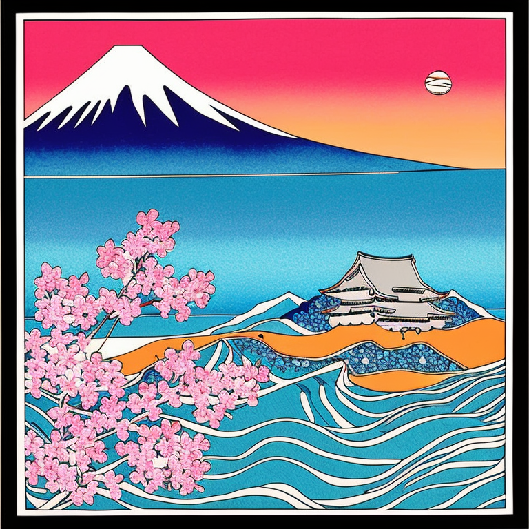
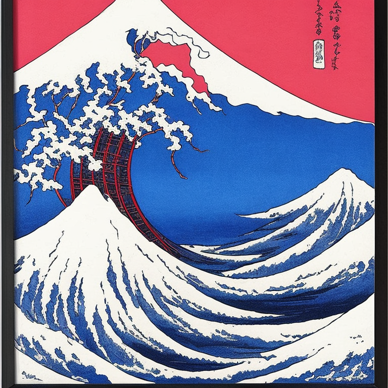
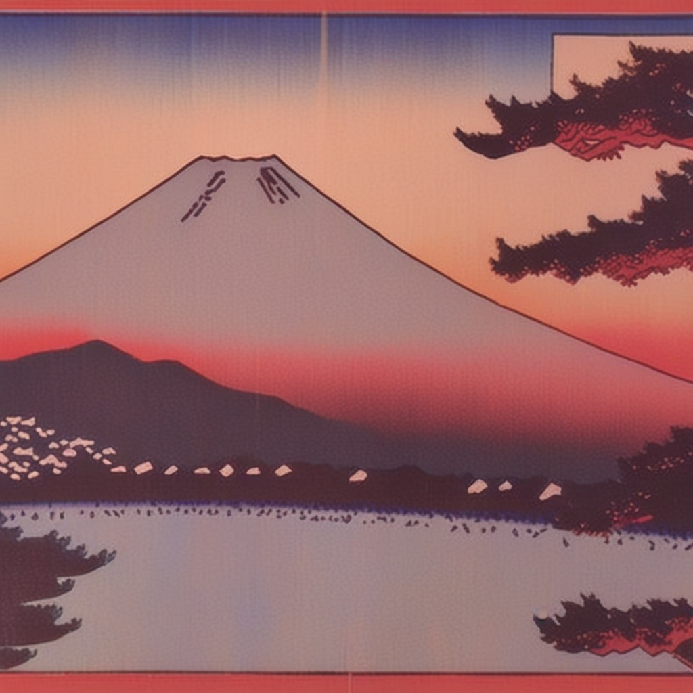
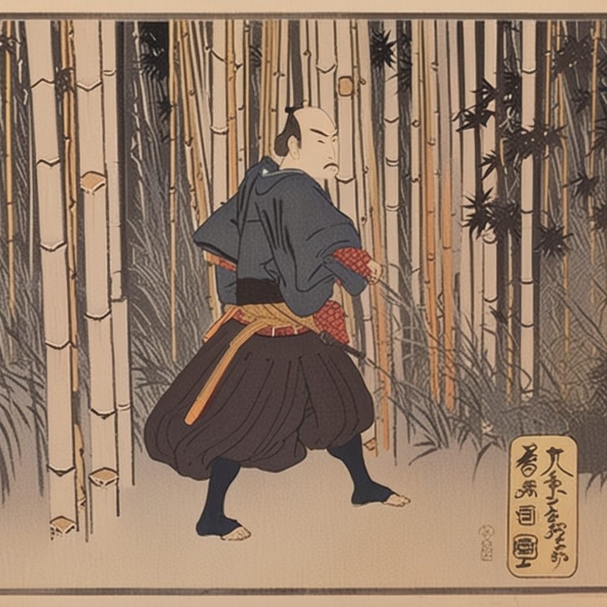
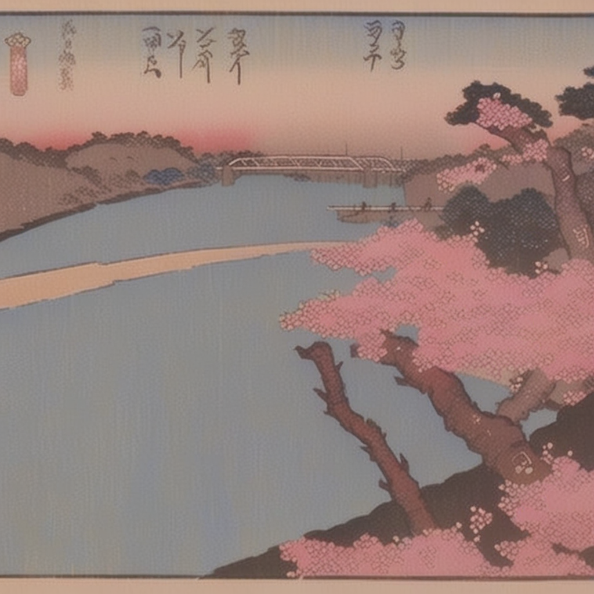
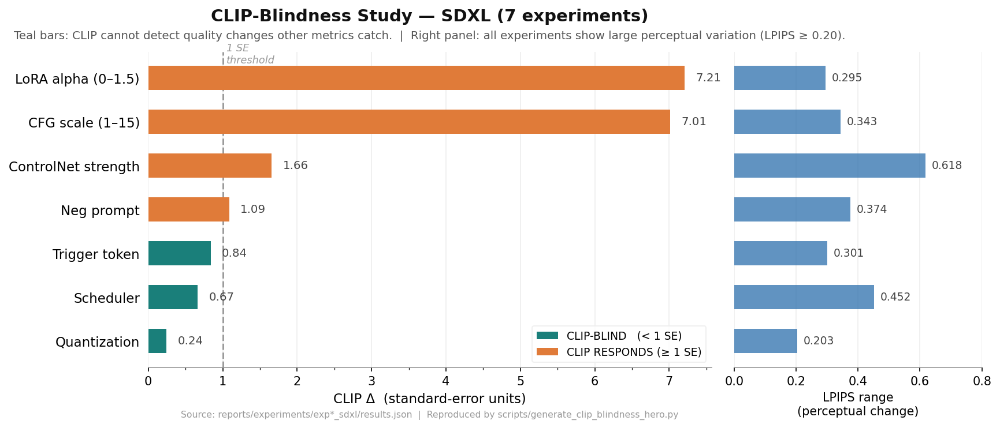
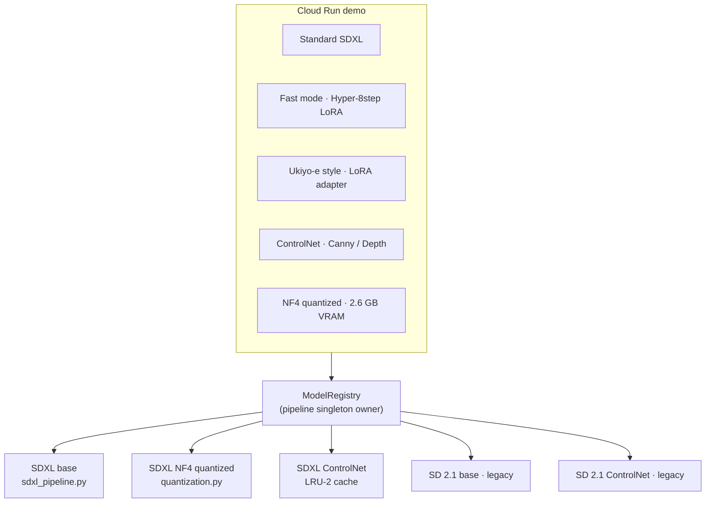
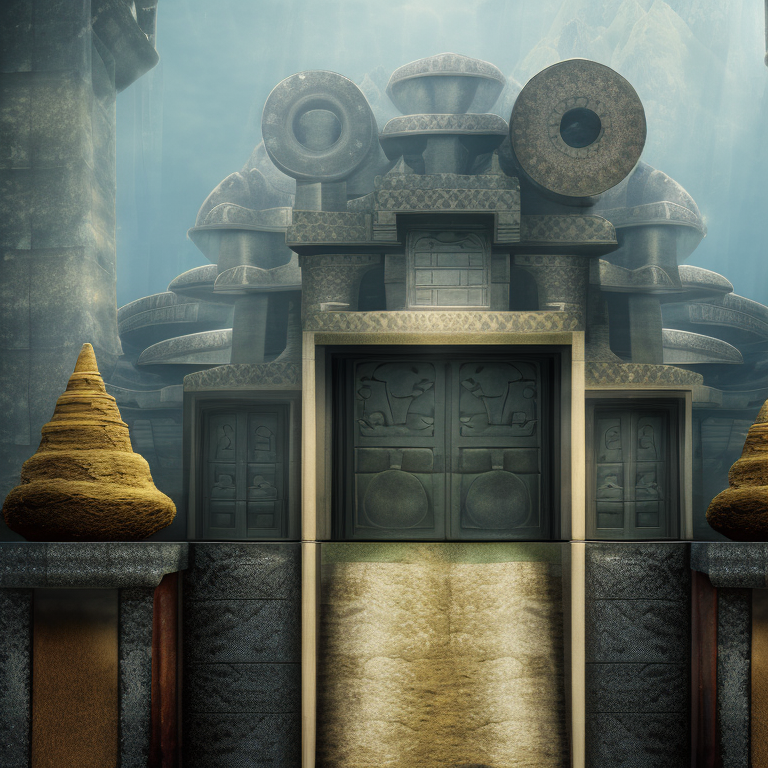
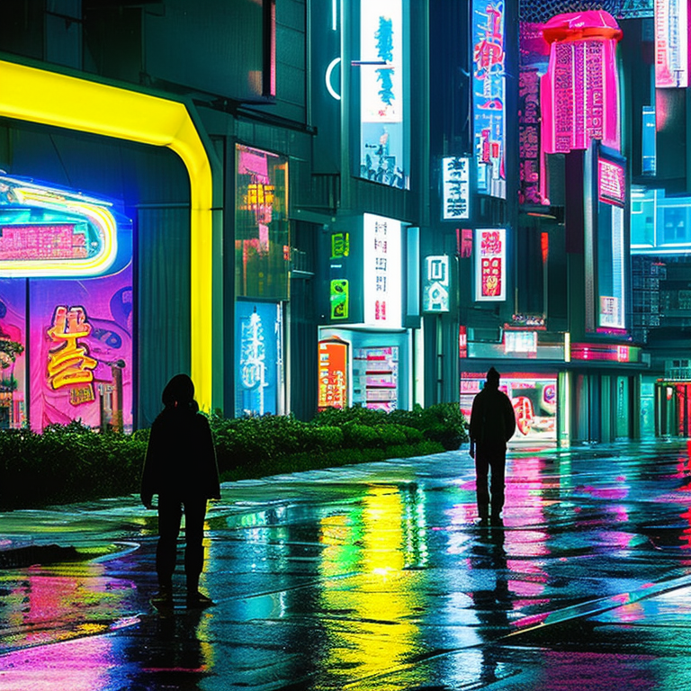

# AetherArt

**An ML engineering project:** I fine-tuned a modern AI image generator to produce Japanese woodblock-print art, made it run on a consumer 8 GB GPU, and deployed it as a live demo — with an honest study of whether the standard quality metric can be trusted.

[](https://aetherart-demo-473907703523.us-central1.run.app)
[](https://github.com/gaurav-gandhi-2411/AetherArt)
[](LICENSE)

---

## Live demo

**[→ aetherart-demo-473907703523.us-central1.run.app](https://aetherart-demo-473907703523.us-central1.run.app)**

Type: `ukyowood ukiyo-e woodblock print of Mount Fuji at sunset` — the trigger word `ukyowood` activates the Ukiyo-e style adapter. Fast mode (Hyper-8step, ~8 s/image) is on by default. Cold start ~5–7 min on first load.

---

## What the LoRA does

Same prompt · same seed (42) · the only difference is whether the Ukiyo-e adapter is loaded.

<table>
  <tr>
    <td align="center">
      <br>
      <em>Without LoRA — standard SDXL base output</em>
    </td>
    <td align="center">
      <br>
      <em>With Ukiyo-e LoRA — Hiroshige palette, flat planes, title cartouche</em>
    </td>
  </tr>
</table>

---

## What I built

### Fitting a large model into 8 GB of VRAM

SDXL's base model is 6.6 GB — before adding a VAE, ControlNet, or anything else. Making it work on a laptop GPU required:

- **FP16 precision** — halves memory use with minimal quality impact. Without this, SDXL simply won't load.
- **NF4 4-bit quantization** — cuts peak VRAM to 2.6 GB. Enables running two pipelines (base + ControlNet) without swapping to CPU.
- **A corrected VAE** — SDXL's default VAE produces black or corrupted images in FP16. The fix (`madebyollin/sdxl-vae-fp16-fix`) is a required component, not optional. Without it, every generation fails silently.

### Fast mode: Hyper-SD 8-step LoRA

Standard SDXL generation takes 25–50 steps (~25 s on the L4). The ByteDance Hyper-SD LoRA cuts this to 8 steps (~8 s) while keeping CFG guidance (and therefore negative prompts) intact. The 4-step variant is faster (~4 s) but disables negative prompts. The demo uses 8-step as its default.

### Style training: Ukiyo-e LoRA

LoRA (Low-Rank Adaptation) fine-tunes large models without retraining them from scratch — instead of updating 6 billion parameters, you train a small adapter that modifies the model's behavior. I trained one on 80 WikiArt ukiyo-e images over 4 h 26 min on a GCP L4 (~$3.50 compute). The trigger token `ukyowood` activates it.

- SD 2.1 version: [gauravgandhi2411/aetherart-ukiyo-sd21](https://huggingface.co/gauravgandhi2411/aetherart-ukiyo-sd21) (6.4 MB, 512×512)
- SDXL version: [gauravgandhi2411/aetherart-ukiyo-sdxl](https://huggingface.co/gauravgandhi2411/aetherart-ukiyo-sdxl) (45 MB, 1024×1024)

Checkpoint selected from a 500/1000/1500 sweep scored by HPSv2.1 + ImageReward — see [`reports/lora_checkpoint_eval_sdxl/checkpoint-1000_grid.png`](reports/lora_checkpoint_eval_sdxl/checkpoint-1000_grid.png) for the winning-checkpoint grid.

### Controllable generation: ControlNet

ControlNet lets you guide the *composition* of an image using a depth map or edge map — you control where objects appear, the model fills in the style. SD 2.1 and SDXL use different ControlNet checkpoints and depth-estimation models (see [docs/depth_estimators.md](docs/depth_estimators.md) for why).

---

## Results dashboard

### Scored outputs — Ukiyo-e LoRA, seed 42, DPM-Solver++ 30 steps, 1024×1024

Scores from GCP L4 eval run (2026-06-01). HPS and ImageReward are the operative quality metrics — CLIP is comparison-only (blind to style quality; see below).

| Prompt | CLIP | HPS | ImageReward | Image |
|---|---|---|---|---|
| ukyowood ukiyo-e print of **a crane over ocean waves** | 0.362 | 0.282 | 1.846 |  |
| ukyowood ukiyo-e woodblock print of **Mount Fuji at sunset** | 0.365 | 0.218 | 1.607 |  |
| ukyowood ukiyo-e woodblock print of **a samurai in a bamboo forest** | 0.348 | 0.242 | 1.138 |  |
| ukyowood ukiyo-e print of **cherry blossoms along a river** | 0.362 | 0.215 | 1.324 |  |

*Source: `docs/lab_notebook.md` lines 260–263 (GCP L4 validation run, 2026-06-01)*

### VRAM by configuration

| Config | Peak VRAM | Source |
|---|---|---|
| SDXL NF4 4-bit (bitsandbytes) | **2.6 GB** (2611 MB) | `reports/experiments/exp1_sdxl/results.json` — all NF4 rows |
| SDXL FP16 + Ukiyo-e LoRA | **6.2 GB** | GCP L4 eval run 2026-06-01 (`docs/lab_notebook.md` line 266) |

---

## The CLIP-blindness finding

CLIP score — the standard proxy for "does this image match the prompt?" — is blind to many quality changes that matter.

<p align="center">
  
  <br>
  <em>Teal bars: CLIP cannot detect quality changes that LPIPS registers.  
  Orange bars: CLIP can — because these sweeps shift semantic content, not just visual character.</em>
</p>

**Source:** `reports/experiments/exp*_sdxl/results.json` — reproduced by `scripts/generate_clip_blindness_hero.py`

**CLIP is structurally blind to rendering-level parameters** (quantization precision, scheduler choice, trigger-token presence) while remaining responsive to semantic sweeps (CFG scale, LoRA style intensity). This holds at every threshold tested.

→ Full analysis: [reports/clip_blindness_sdxl.md](reports/clip_blindness_sdxl.md)

---

## The self-correction

The original SD 2.1 study used a qualitative judgment for the blind/responds call. Applying a hard 1-SE statistical threshold to the SDXL replication — then going back and applying the same threshold to the original SD 2.1 data — gave a different answer:

| Stage | CLIP-blind result | Note |
|---|---|---|
| Original SD 2.1 claim | 9 / 9 | Qualitative CLIP-vs-LPIPS ratio judgment |
| SD 2.1 recomputed (1-SE threshold) | 4 / 9 | Exp3/4/5 were above 1 SE; called blind qualitatively |
| SDXL replication (1-SE threshold) | 3 / 7 | Architecture-dependent; SDXL is less CLIP-blind |

Source: `reports/clip_blindness_sdxl.md` (sensitivity table, < 1.0 SE row; SD 2.1 correction note in `reports/clip_blindness.md`)

The direction is stable: SDXL is less CLIP-blind than SD 2.1 regardless of where the line is drawn. The original overstated headline is documented rather than erased — both model cards report it. The methodology for the correction is in [reports/clip_blindness_sdxl.md](reports/clip_blindness_sdxl.md).

---

## How it's built


```mermaid
flowchart TD
    subgraph CR["Cloud Run demo"]
        direction LR
        M1["Standard SDXL"]
        M2["Fast mode · Hyper-8step LoRA"]
        M3["Ukiyo-e style · LoRA adapter"]
        M4["ControlNet · Canny / Depth"]
        M5["NF4 quantized · 2.6 GB VRAM"]
    end
    CR --> MR["ModelRegistry\n(pipeline singleton owner)"]
    MR --> P1["SDXL base\nsdxl_pipeline.py"]
    MR --> P2["SDXL NF4 quantized\nquantization.py"]
    MR --> P3["SDXL ControlNet\nLRU-2 cache"]
    MR --> P4["SD 2.1 base · legacy"]
    MR --> P5["SD 2.1 ControlNet · legacy"]
```

| Component | Model | Role |
|---|---|---|
| Base (SDXL) | `stabilityai/stable-diffusion-xl-base-1.0` | Text-to-image |
| VAE (SDXL) | `madebyollin/sdxl-vae-fp16-fix` | Required — prevents NaN/black images |
| Ukiyo-e LoRA (SDXL) | `gauravgandhi2411/aetherart-ukiyo-sdxl` | Woodblock print style (rank-8, 45 MB) |
| Hyper-8step LoRA | `ByteDance/Hyper-SD` | Fast mode — 8 steps, ~8 s on L4 |
| ControlNet (SDXL) | `diffusers/controlnet-depth-sdxl-1.0` | Depth/edge conditioning |
| Depth estimator | `LiheYoung/depth-anything-small-hf` | Safetensors, CVE-compliant |
| Safety | `Falconsai/nsfw_image_detection` | NSFW guard |

---

## Project phases: SD 2.1 → SDXL

### SD 2.1 phase (Phases 1–6b, Windows / RTX 3070)

- SD 2.1 inference on 8 GB VRAM via FP16 + model CPU offload — 3.2 s/image
- Rank-8 Ukiyo-e LoRA trained in 2 h 8 min on 80 WikiArt images at 512×512
- ControlNet Canny + Depth with 2-entry LRU pipeline cache
- LCM 4-step (0.6 s/image); SDXL Turbo 1-step explored (now gated behind `AETHERART_ENABLE_LEGACY=1`)
- INT8 + NF4 quantization via bitsandbytes
- 360-run CLIP benchmark: 4 schedulers × 3 step counts × 30 prompts
- Nine Phase 6b experiments on CLIP-blindness

### SDXL phase (Phase 7, GCP L4 24 GB)

- SDXL base + `madebyollin/sdxl-vae-fp16-fix` (required to prevent NaN/black images)
- Rank-8 Ukiyo-e LoRA retrained at 1024×1024 on the same 80 WikiArt images — 4 h 26 min, ~$3.50
- Hyper-SD 8-step LoRA as the fast default
- ControlNet Union for unified edge/depth/pose conditioning
- NSFW safety guard
- HPSv2.1 + ImageReward eval harness (GCP Linux — see dev/eval split below)
- CLIP-blindness replicated and corrected across both architectures

---

## Experiments

### Phase 6b — SD 2.1

| Experiment | Headline result |
|---|---|
| [Quantization quality](reports/experiments/exp1_quantization_quality/findings.md) | All three within 1 SE on CLIP. NF4 vs FP16 LPIPS = 0.40 — perceptually large, CLIP-invisible. |
| [Negative prompt impact](reports/experiments/exp2_negative_prompt/findings.md) | CLIP delta +0.003 (within noise). LPIPS = 0.46 between conditions. |
| [CFG scale sweep](reports/experiments/exp3_cfg_sweep/findings.md) (CFG 1–15) | CLIP plateaus at CFG=5, flat to CFG=15. LPIPS vs CFG=7 reaches 0.47 at CFG=15. |
| [Scheduler visual comparison](reports/experiments/exp4_scheduler_visual/findings.md) | Two LPIPS clusters: EulerA (stochastic) 0.72–0.73 vs deterministic 0.31–0.48. |
| [ControlNet strength sweep](reports/experiments/exp5_controlnet_strength/findings.md) | CLIP flat 0.0–1.0. LPIPS V-shape: no conditioning = 0.72; over-conditioning = 0.32. |
| [LoRA rank ablation](reports/experiments/exp6_lora_rank/findings.md) (rank 4/8/16) | CLIP spread <1 SE. Rank-4 CLIP > rank-8 (underfitting paradox). |
| [LoRA data size ablation](reports/experiments/exp7_lora_data_size/findings.md) (20/40/80 img) | CLIP spread <1 SE. Data-20 scores higher than data-80 (underfitting paradox). |
| [LoRA alpha sweep](reports/experiments/exp8_lora_alpha/findings.md) (alpha 0.0–1.5) | CLIP rises +4 SE switching LoRA on, then flat. Alpha 0.5→1.5 invisible to CLIP. |
| [Trigger token sensitivity](reports/experiments/exp9_lora_trigger/findings.md) | CLIP delta −0.0008 (pure noise). LPIPS = 0.41 — trigger redirects LoRA; CLIP is blind. |

### SDXL replication (Phase 7)

| Experiment | SD 2.1 result | SDXL result |
|---|---|---|
| Quantization quality | CLIP-blind (0.94 SE) | CLIP-blind (0.24 SE) |
| CFG scale sweep | CLIP-blind (1.10 SE) | CLIP-responsive (7.01 SE) |
| Scheduler visual | CLIP-blind (1.80 SE) | CLIP-blind (0.67 SE) |
| ControlNet strength | CLIP-blind (2.20 SE) | CLIP-responsive (1.66 SE) |
| LoRA alpha sweep | CLIP-blind (4.00 SE) | CLIP-responsive (7.21 SE) |
| Trigger token | CLIP-blind (0.12 SE) | CLIP-blind (0.84 SE) |
| Negative prompt | CLIP-blind (0.83 SE) | CLIP-responsive (1.09 SE) |

→ [reports/clip_blindness_sdxl.md](reports/clip_blindness_sdxl.md)

---

## Controllable generation and checkpoint selection

### ControlNet

ControlNet constrains image *composition* using an edge map (Canny) or depth map — you choose where objects appear, the model fills in the style.

<table>
  <tr>
    <td align="center">
      <br>
      <em>Edge-guided (Canny) — composition follows extracted edge map</em>
    </td>
    <td align="center">
      <br>
      <em>Depth-guided — spatial layout follows estimated depth map</em>
    </td>
  </tr>
</table>

### LoRA checkpoint selection

Three checkpoints evaluated at 500/1000/1500 steps against four fixed prompts at seed 42:

- **Checkpoint 500:** Active ukiyo-e style injection but over-calligraphed (multiple cartouche boxes per image), weak figure scale on samurai prompt. Not selected.
- **Checkpoint 1000 (selected):** Deepest Hiroshige teal/blue rendering, warm coral-pink horizon on Fuji, samurai figure clearly visible. Calligraphy appears as single-panel title cartouches (compositionally faithful to real woodblock prints). Style lift over baseline is unambiguous.
- **Checkpoint 1500:** Style strong but samurai figure drop-out returns; cherry-blossom prompt softer/less saturated. Loss jump at step 1500 (0.008 → ~0.08) correlates with a visible quality regression. Not selected.

See [`reports/lora_checkpoint_eval_sdxl/checkpoint-1000_grid.png`](reports/lora_checkpoint_eval_sdxl/checkpoint-1000_grid.png) for the winning-checkpoint 4-prompt grid. Full comparison in [`reports/lora_training_summary_sdxl.md`](reports/lora_training_summary_sdxl.md).

---

## Additional findings

### Prompt choice matters 18× more than scheduler choice

360 generations (4 schedulers × 3 step counts × 30 prompts). DPM-Solver++ leads on CLIP score (0.3177 overall), but the entire scheduler-to-scheduler range is 0.007. The prompt-to-prompt range is 0.130 — **18× larger**. Picking the right prompt matters far more than which scheduler you use.

DPM-Solver++ at 20 steps matches DDIM at 50 steps within noise. DPM@30 is the sweet spot — essentially free quality gain at 40% less wall time than 50 steps.

→ Full benchmark: [reports/findings.md](reports/findings.md)

### The underfitting paradox (SD 2.1 only)

Rank-4 LoRA scored *higher* on CLIP than rank-8 (0.3384 vs 0.3337). Data-20 scored higher than data-80. The reason: underfit models produce more literal keyword matches; CLIP rewards literalness, not visual quality. This finding is SD 2.1-specific — the equivalent SDXL experiments (exp6/exp7) were not run.

→ Source: [reports/experiments/exp6_lora_rank/findings.md](reports/experiments/exp6_lora_rank/findings.md)

### What 512 → 1024 did to the calligraphy artifact

The training images are WikiArt photographs of woodblock prints, which carry calligraphy text in their margins. The LoRA absorbed this as part of ukiyo-e style. At 512×512 (SD 2.1) it appeared as scattered characters in image borders. At 1024×1024 (SDXL) the same learned signal appears as single-panel title cartouches and red banner seals — placed where a real woodblock print would carry its title block. It went from noise to something that reads as intentional style.

---

## Run it locally

**Local setup:**

```bash
git clone https://github.com/gaurav-gandhi-2411/AetherArt.git
cd AetherArt
conda create -n aetherart python=3.10 -y
conda activate aetherart
pip install -r requirements.txt

# Launch Gradio UI (downloads ~10 GB on first run)
python app.py

# Run tests — no GPU required (all heavy deps mocked)
pytest -q              # 229 tests, ~60 s
```

**GPU requirements:**
- SDXL FP16: ~10 GB VRAM minimum; 24 GB (L4/A10G) for comfortable use
- SDXL NF4 quantized: ~6 GB VRAM
- SD 2.1 FP16 (legacy): ~3 GB VRAM with model CPU offload

VRAM measured on GCP L4 with `enable_model_cpu_offload()`. See [CONTRIBUTING.md](CONTRIBUTING.md) for the full dev environment including CUDA-specific torch install and exact package lock.

---

## Dev/eval environment split

Development runs on **Windows 11 / RTX 3070 8 GB**. Eval and benchmarking runs on **GCP Linux / NVIDIA L4**.

This is a deliberate choice: `ImageReward` imports trigger a `pyarrow` C-extension access violation on Windows (SIGSEGV before any Python `try/except` can catch it). On Linux the import is clean. The test suite mocks heavy GPU dependencies and runs cleanly on Windows. All real eval numbers in this repo were produced on GCP.

---

## Technical reference

### Quantization

| Precision | Peak VRAM (SD 2.1 Exp 1) | vs FP16 | Avg latency |
|-----------|------------------------:|---------|-------------|
| FP16 (default) | 1803 MB | — | 4.4 s/img |
| 8-bit INT8 | **2210 MB** | **+407 MB** | 12.3 s/img |
| 4-bit NF4 | 1382 MB | −421 MB | 6.4 s/img |

INT8 costs *more* VRAM under CPU offload (bitsandbytes allocates a full FP16 compute buffer for dequantization). NF4 savings survive because 4-bit compression outpaces the buffer cost.

→ [reports/experiments/exp1_quantization_quality/findings.md](reports/experiments/exp1_quantization_quality/findings.md)

### Speed tiers (SD 2.1, RTX 3070)

| Mode | Steps | RTX 3070 | Note |
|------|------:|----------|------|
| Standard FP16 (no CPU offload) | 30 | **3.2 s/img** | Full baseline |
| LCM fast (4-step) | 4 | **0.6 s/img** | Moderate quality reduction |
| SDXL Turbo (1-step, SDXL arch) | 1 | **3.3 s/img** | Requires `AETHERART_ENABLE_LEGACY=1` |

*Timing from informal measurements in [docs/lab_notebook.md](docs/lab_notebook.md) — not from the 360-run harness.*

---

## Reproducibility

| Artifact | Command | Hardware | Time |
|---|---|---|---|
| 360-run CLIP benchmark | `python scripts/eval.py` | RTX 3070 8 GB | ~4 h |
| SD 2.1 Ukiyo-e LoRA | `python scripts/train_lora.py` | RTX 3070 8 GB | ~2 h |
| Quantization benchmark | `python scripts/benchmark_quantization.py` | RTX 3070 8 GB | ~30 min |
| Benchmark charts | `python scripts/generate_benchmark_charts.py` | CPU only | < 1 min |
| HPSv2.1 + ImageReward eval | `python scripts/eval.py --scorers hps,ir` | GCP L4 Linux | — |

**Known limitations:** `eval.py` requires models cached locally. `train_lora.py` requires WikiArt data via `scripts/prepare_lora_dataset.py`. HPSv2.1 and ImageReward require Linux. Results are deterministic for the same hardware — different GPU models may produce different pixel values from the same seed.

---

## Project structure

```
AetherArt/
├── app.py                                  # Gradio UI
├── cloudrun_app.py                         # Cloud Run entrypoint (SDXL demo)
├── aetherart/
│   ├── model.py                            # SD 2.1 pipeline + VRAM optimisations
│   ├── sdxl_pipeline.py                    # SDXL base loader (fp16-fix VAE + DPM++)
│   ├── controlnet.py                       # SD 2.1 ControlNet
│   ├── controlnet_sdxl.py                  # SDXL ControlNet
│   ├── lora.py                             # LoRA registry, load/unload
│   ├── hyper.py                            # Hyper-SD LoRA + EulerDiscrete scheduler swap
│   ├── lcm.py                              # LCM scheduler switching (SD 2.1)
│   ├── quantization.py                     # 4-bit NF4 / 8-bit INT8 via bitsandbytes
│   ├── safety.py                           # NSFW guard
│   ├── registry.py                         # ModelRegistry — pipeline singleton owner
│   └── config.py                           # Env-driven config
├── data/lora/ukiyo-e/
│   ├── ukiyo-e-lora.safetensors            # SD 2.1 adapter (6.4 MB, checkpoint-1000)
│   └── metadata.jsonl                      # 80 captions with ukyowood trigger
├── scripts/
│   ├── eval.py                             # 360-run CLIP + HPSv2.1 + ImageReward harness
│   ├── train_lora.py                       # SD 2.1 LoRA training wrapper
│   └── experiments/                        # Phase 6b + Phase 7 SDXL experiment scripts
├── docs/
│   ├── lab_notebook.md                     # Dated research log
│   ├── depth_estimators.md                 # Two-estimator architecture rationale
│   └── model_cards/                        # sd21_ukiyo_e.md, sdxl_ukiyo_e.md
├── reports/
│   ├── clip_blindness.md                   # SD 2.1 CLIP-blindness full writeup
│   ├── clip_blindness_sdxl.md              # SDXL replication + correction
│   ├── findings.md                         # 360-run benchmark narrative
│   ├── lora_training_summary_sdxl.md       # SDXL LoRA training report
│   ├── lora_training_summary_sdxl_samples/ # checkpoint-1000 gallery PNGs (committed)
│   └── what_didnt_work.md                  # Honest failures log
└── tests/                                  # pytest suite — 229 tests, 60% coverage
```

---

## Project documentation

- **[reports/clip_blindness.md](reports/clip_blindness.md)** — SD 2.1 CLIP-blindness: evidence table, underfitting paradox, practical implications.
- **[reports/clip_blindness_sdxl.md](reports/clip_blindness_sdxl.md)** — SDXL replication: corrected SD 2.1 baseline, sensitivity table, architecture comparison.
- **[docs/lab_notebook.md](docs/lab_notebook.md)** — Dated research log: decisions, surprises, what the data showed vs expected.
- **[reports/what_didnt_work.md](reports/what_didnt_work.md)** — Honest account of bugs, abandoned approaches, and the Phase 6b experiment substitution incident.
- **[docs/depth_estimators.md](docs/depth_estimators.md)** — Why two depth models (dpt-hybrid-midas vs depth-anything) and the CVE-2025-32434 context.
- **[reports/findings.md](reports/findings.md)** — Main benchmark narrative (360-run CLIP benchmark + Phase 6b overview).
- **[CHANGELOG.md](CHANGELOG.md)** — Phased project history.

---

## References

- [Latent Diffusion Models](https://arxiv.org/abs/2112.10752) — Rombach et al., CVPR 2022
- [Latent Consistency Models](https://arxiv.org/abs/2310.04378) — Luo et al., 2023
- [SDXL Turbo: Adversarial Diffusion Distillation](https://stability.ai/research/adversarial-diffusion-distillation) — Stability AI, 2023
- [LoRA: Low-Rank Adaptation](https://arxiv.org/abs/2106.09685) — Hu et al., ICLR 2022
- [ControlNet](https://arxiv.org/abs/2302.05543) — Zhang et al., ICCV 2023
- [PartiPrompts](https://github.com/google-research/parti) — Google Research eval benchmark
- [bitsandbytes](https://github.com/TimDettmers/bitsandbytes) — Tim Dettmers et al.

For BibTeX entries: [CITATIONS.bib](CITATIONS.bib).

**Models used:**
- SD 2.1: [sd2-community/stable-diffusion-2-1](https://huggingface.co/sd2-community/stable-diffusion-2-1)
- SDXL base: [stabilityai/stable-diffusion-xl-base-1.0](https://huggingface.co/stabilityai/stable-diffusion-xl-base-1.0)
- SDXL VAE: [madebyollin/sdxl-vae-fp16-fix](https://huggingface.co/madebyollin/sdxl-vae-fp16-fix)
- Hyper-SD: [ByteDance/Hyper-SD](https://huggingface.co/ByteDance/Hyper-SD)
- ControlNet: [thibaud's SD 2.1](https://huggingface.co/thibaud) · [diffusers SDXL depth](https://huggingface.co/diffusers/controlnet-depth-sdxl-1.0)
- Depth Anything: [LiheYoung/depth-anything-small-hf](https://huggingface.co/LiheYoung/depth-anything-small-hf)
- WikiArt training data: [huggan/wikiart](https://huggingface.co/datasets/huggan/wikiart)
- Hugging Face [diffusers](https://github.com/huggingface/diffusers) library and training scripts
