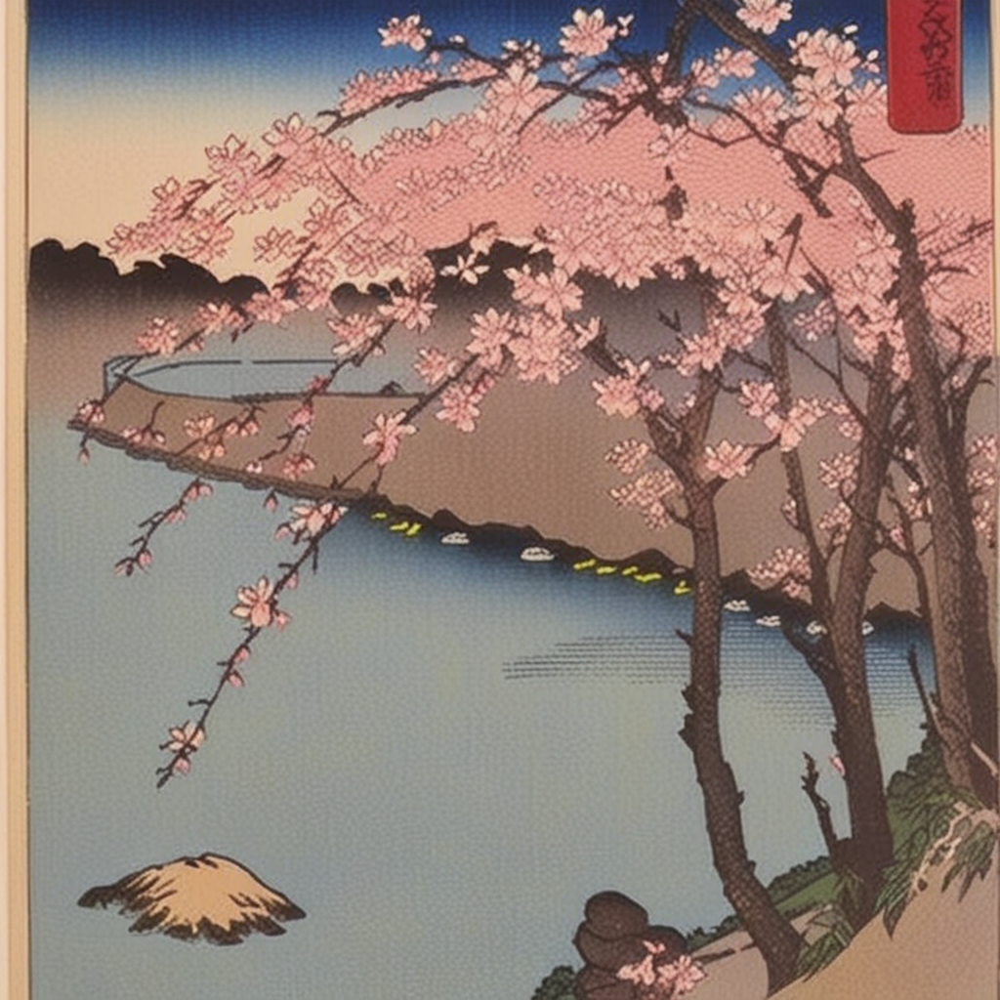

# AetherArt — Diffusion Inference on a Laptop GPU

[](https://aetherart-demo-473907703523.us-central1.run.app)
[](https://github.com/gaurav-gandhi-2411/AetherArt)
[](LICENSE)

## Live demo

**[→ Cloud Run (NVIDIA L4, fast)](https://aetherart-demo-473907703523.us-central1.run.app)**  
SDXL + Ukiyo-e LoRA, Hyper-8step fast default, ControlNet, safety guard.
~5–7 min cold start (model download), then fast (~8 s/image on L4).

---

## What this is

A personal research project: implement modern diffusion model inference end-to-end on an 8 GB laptop GPU, understand what each piece actually costs, and measure the tradeoffs honestly. The RTX 3070 forced every architectural choice — 8 GB is enough to run SD 2.1, not enough to be casual about memory layout.

I built this to understand each component deeply — not to ship a product. The code is production-grade (CI, type annotations, test coverage, a registry that owns pipeline singletons) because those constraints force cleaner understanding of the internals.

---

## Gallery

All sample images generated at seed 42 with the SDXL Ukiyo-e LoRA (checkpoint-1000, DPM-Solver++ 25 steps, 1024×1024).

| Mount Fuji at sunset | Crane over ocean waves |
|---|---|
|  |  |
| *"ukyowood ukiyo-e woodblock print of Mount Fuji at sunset"* | *"ukyowood ukiyo-e print of a crane over ocean waves"* |

| Samurai in bamboo forest | Cherry blossoms along a river |
|---|---|
|  |  |
| *"ukyowood ukiyo-e woodblock print of a samurai in a bamboo forest"* | *"ukyowood ukiyo-e print of cherry blossoms along a river"* |

---

## The modernization story: SD 2.1 → SDXL

This project spans two generations of diffusion models. The evolution is documented and benchmarked rather than hidden.

### SD 2.1 phase (Phases 1–6b, Windows / RTX 3070)

- SD 2.1 inference on 8 GB VRAM via fp16 + model CPU offload — 3.2 s/image
- Rank-8 Ukiyo-e LoRA trained in 2 h 8 min on 80 WikiArt images at 512×512
- ControlNet Canny + Depth with 2-entry LRU pipeline cache
- LCM 4-step (0.6 s); SDXL Turbo 1-step explored as a comparison (uses SDXL architecture, now gated behind `AETHERART_ENABLE_LEGACY=1`)
- INT8 + NF4 quantization via bitsandbytes
- 360-run CLIP benchmark: 4 schedulers × 3 step counts × 30 prompts
- Nine Phase 6b experiments on CLIP-blindness (quantization, CFG, ControlNet, LoRA params)

### SDXL phase (Phase 7, GCP L4 24 GB)

- SDXL base + `madebyollin/sdxl-vae-fp16-fix` (required to prevent NaN/black images)
- Rank-8 Ukiyo-e LoRA retrained at 1024×1024 on the same 80 WikiArt images — 4 h 26 min on GCP L4, ~$3.50
- Hyper-SD 8-step LoRA as the fast default (8 steps, ~8 s on L4, preserves negative prompt)
- ControlNet Union for unified edge/depth/pose conditioning
- NSFW safety guard (aetherart/safety.py)
- HPSv2.1 + ImageReward eval harness (eval/bench runs on GCP Linux — see dev/eval split below)
- CLIP-blindness replicated and compared across both architectures

**Published adapters:**
- [`gauravgandhi2411/aetherart-ukiyo-sd21`](https://huggingface.co/gauravgandhi2411/aetherart-ukiyo-sd21) — SD 2.1, 512×512
- [`gauravgandhi2411/aetherart-ukiyo-sdxl`](https://huggingface.co/gauravgandhi2411/aetherart-ukiyo-sdxl) — SDXL, 1024×1024

---

## Key findings

### 1. CLIP-blindness — the central finding

Nine Phase 6b experiments on SD 2.1 varied one generation parameter at a time (quantization, CFG, ControlNet strength, LoRA rank/data/alpha/trigger). **CLIP delta stayed below 1 SE in most experiments while LPIPS ranged 0.40–0.73.** The metric measures semantic presence, not visual character.

Phase 7 replicated the study on SDXL: **3/7 experiments CLIP-blind on SDXL** vs 4/9 on SD 2.1 at the same 1-SE threshold. SDXL's stronger CLIP alignment means semantic sweeps (CFG scale, LoRA alpha) register clearly — the blindness that remains is confined to rendering-level changes.

**The correction arc:** Rerunning forced a re-examination of the original SD 2.1 "9/9 blind" headline. That figure used a qualitative threshold — comparing LPIPS magnitude to CLIP delta visually. Under the same hard 1-SE cutoff applied to SDXL, SD 2.1 recomputes to **4/9 blind**. Three experiments (exp3/4/5) were called blind qualitatively because LPIPS was large, not because CLIP was statistically flat. The original headline was overstated. Both the correction and its methodology are documented rather than buried.

**Corrected headline:** CLIP-blindness is real on SD 2.1 for rendering-level changes. On SDXL it is substantially weaker — architecture-dependent and more nuanced than first reported. SDXL is less blind at every threshold tested (3–5/7 vs 4–8/9).

→ Full writeup: [reports/clip_blindness.md](reports/clip_blindness.md) · [reports/clip_blindness_sdxl.md](reports/clip_blindness_sdxl.md)

### 2. The calligraphy-cartouche evolution: 512 → 1024

WikiArt source images embed calligraphy text in their margins. The LoRA absorbed this as part of "ukiyo-e style." At 512, this manifests as **scattered characters** in image borders. At 1024 with SDXL's stronger base priors, the same learned signal manifests as **single-panel title cartouches and red banner seals** — compositionally placed where a real woodblock print would carry its title block.

The artifact is still present at 1024, but it reads as a learned stylistic element rather than noise. The default negative prompt suppresses most residual scatter. Both model cards document this explicitly.

→ SDXL LoRA model card: [docs/model_cards/sdxl_ukiyo_e.md](docs/model_cards/sdxl_ukiyo_e.md)

### 3. Scheduler benchmark: prompt choice matters 18× more

360-run CLIP benchmark: 4 schedulers × 3 step counts × 30 PartiPrompts. DPM-Solver++ leads (0.3177) but the scheduler range (0.007) is dwarfed by the prompt-to-prompt range (0.130) — an 18× ratio. DPM@20 steps reaches DPM@30 quality within noise at 24% less wall time.

→ Full results: [reports/findings.md](reports/findings.md)

### 4. The underfitting paradox (SD 2.1)

**SD 2.1 only.** Rank-4 LoRA scored *higher* on CLIP than rank-8 (0.3384 vs 0.3337); data-20 scored higher than data-80. Underfit models produce more literal keyword matches; CLIP rewards literalness, not visual quality. SDXL exp6/exp7 (rank and data-size ablations) were not run — dataset staging gap on the eval VM. This finding is SD 2.1-specific until replicated on SDXL.

→ Source: [reports/experiments/exp6_lora_rank/findings.md](reports/experiments/exp6_lora_rank/findings.md) · [reports/experiments/exp7_lora_data_size/findings.md](reports/experiments/exp7_lora_data_size/findings.md)

---

## Dev/eval environment split

Interactive development runs on **Windows 11 / RTX 3070 8 GB**. All eval and benchmarking runs on **GCP Linux / NVIDIA L4**.

This is a deliberate engineering decision, not a workaround:

- `ImageReward`'s `__init__.py` imports `ReFL → datasets → pandas → pyarrow.dataset C extension`. On Windows with pyarrow 24.x, this causes an access violation SIGSEGV in the C extension before any Python `try/except` can catch it. On Linux the import is clean.
- `hpsv2 1.2.0` has a headless Linux bug (`from turtle import forward` — accidental stdlib import that chains to tkinter). Fixed by patching line 8 of `src/open_clip/factory.py` on the eval VM; not a Windows issue.

The test suite (`tests/`) mocks heavy GPU dependencies and runs cleanly on Windows. The `testpaths = ["tests"]` config prevents pytest from collecting `scripts/_ir_test.py` (which would SIGSEGV). All real eval numbers in this repo were produced on GCP.

---

## Architecture

```
┌──────────────────────────────────────────────────────────────┐
│                        Cloud Run demo                        │
│  SDXL base + fp16-fix VAE  │  Hyper-8step LoRA (default)    │
│  Ukiyo-e LoRA (optional)   │  ControlNet (Canny/Depth)       │
│  Safety guard              │  NF4 quantized variant          │
└──────────────────────────────────────────────────────────────┘

ModelRegistry (pipeline singleton owner)
  ├─ SDXL base (load_sdxl_base → sdxl_pipeline.py)
  ├─ SDXL quantized (load_sdxl_quantized → quantization.py)
  ├─ SDXL ControlNet [LRU-2 cache, keyed by (ctype, lora, alpha)]
  ├─ SD 2.1 base (legacy)
  └─ SD 2.1 ControlNet (legacy)
```

| Component | Model | Role |
|---|---|---|
| Base (SDXL) | `stabilityai/stable-diffusion-xl-base-1.0` | Text-to-image |
| VAE (SDXL) | `madebyollin/sdxl-vae-fp16-fix` | Required — prevents NaN/black images |
| Ukiyo-e LoRA (SDXL) | `gauravgandhi2411/aetherart-ukiyo-sdxl` | Woodblock print style (rank-8, 45 MB) |
| Hyper-8step LoRA | `ByteDance/Hyper-SD` | 8-step fast mode, ~8 s on L4 |
| ControlNet (SDXL) | `diffusers/controlnet-depth-sdxl-1.0` | Depth/edge conditioning |
| Depth estimator (SDXL) | `LiheYoung/depth-anything-small-hf` | Safetensors, CVE-compliant |
| Safety | `Falconsai/nsfw_image_detection` | NSFW guard |
| Base (SD 2.1, legacy) | `sd2-community/stable-diffusion-2-1` | Legacy local path |
| Depth estimator (SD 2.1) | `Intel/dpt-hybrid-midas` | Matched to SD 2.1 ControlNet training |
| Scheduler | DPMSolverMultistepScheduler | Best CLIP/latency in 360-run benchmark |

See [docs/depth_estimators.md](docs/depth_estimators.md) for why two depth models are used.

---

## Running locally

```bash
# Clone and install
git clone https://github.com/gaurav-gandhi-2411/AetherArt
conda create -n aetherart python=3.10
conda activate aetherart
pip install -r requirements.txt

# Launch Gradio UI (SDXL mode, downloads ~10 GB on first run)
python app.py

# Run tests (no GPU required — heavy deps mocked)
pytest
```

**GPU requirements:**
- SDXL FP16: ~10 GB VRAM minimum; 24 GB (L4/A10G) for comfortable use
- SDXL NF4 quantized: ~6 GB VRAM
- SD 2.1 FP16 (legacy): ~3 GB VRAM with model CPU offload
- SDXL ControlNet FP16: peaks at 7928 MB locally (≥ 8 GB required, offload-bound at ~285 s/image)

---

## Models & Techniques

### SDXL Ukiyo-e LoRA

| Parameter | Value |
|---|---|
| Base model | `stabilityai/stable-diffusion-xl-base-1.0` |
| Dataset | 80 WikiArt Ukiyo-e images, trigger `ukyowood` |
| Rank | 8 |
| Steps | 1500 (checkpoint-1000 selected) |
| LR | 1e-4, fp16 mixed precision |
| Wall time | 4 h 26 min, GCP L4 24 GB |
| Compute cost | ~$3.50 (GCP on-demand, us-central1) |
| Adapter size | 45 MB |

**Checkpoint selection:** Evaluated 500/1000/1500 against four fixed prompts at seed 42.
Checkpoint-1000 selected: deepest Hiroshige palette, figure preserved across all prompts,
calligraphy rendered as integrated title cartouches rather than scattered characters.
The 1000-step convergence is consistent with the SD 2.1 companion run — both visual
evaluations independently selected the checkpoint-1000 step count.

**Baseline control:** The eval included a no-LoRA SDXL baseline, confirming the adapter
adds measurable value above SDXL's pretraining priors (deeper Hiroshige teal/blue palette,
warm coral-pink atmospheric haze, characteristic flat-plane foliage treatment).

*Full checkpoint analysis: [reports/lora_training_summary_sdxl.md](reports/lora_training_summary_sdxl.md)*

### SD 2.1 Ukiyo-e LoRA (legacy)

| Parameter | Value |
|---|---|
| Base model | `sd2-community/stable-diffusion-2-1` |
| Dataset | 80 WikiArt Ukiyo-e images, trigger `ukyowood` |
| Rank | 8 |
| Steps | 1500 (checkpoint-1000 selected) |
| Wall time | 2 h 8 min, RTX 3070 8 GB |
| Adapter size | 6.4 MB |

### Hyper-SD (fast default)

ByteDance Hyper-SDXL 8-step LoRA: 8-inference-step generation with CFG guidance preserved.
Used as the demo default — ~8 s on L4 vs ~25 s for standard 25-step DPM.
The 4-step variant (CFG-free, ~4 s) is available but disables negative prompts.

### ControlNet

SD 2.1 and SDXL use different ControlNet checkpoints and different depth estimators.
See [docs/depth_estimators.md](docs/depth_estimators.md) for the rationale.

### Quantization

| Precision | Peak VRAM (SD 2.1 Exp 1) | vs fp16 | Avg latency (model CPU offload) |
|-----------|------------------------:|---------|-------------|
| fp16 (default) | 1803 MB | — | 4.4 s/img |
| 8-bit INT8 | **2210 MB** | **+407 MB** | 12.3 s/img |
| 4-bit NF4 | 1382 MB | −421 MB | 6.4 s/img |

INT8 costs *more* VRAM under CPU offload (bitsandbytes allocates a full fp16 compute buffer for dequantization). NF4 savings survive because 4-bit compression outpaces the buffer cost. Details: [reports/experiments/exp1_quantization_quality/findings.md](reports/experiments/exp1_quantization_quality/findings.md)

---

## Performance

### Speed tiers (SD 2.1, RTX 3070)

| Mode | Steps | RTX 3070 (local) | Quality |
|------|------:|------------------|---------|
| Standard fp16 (no CPU offload) | 30 | **3.2 s/img** | Full baseline |
| LCM fast (4-step) | 4 | **0.6 s/img — 5.3×** | Moderate reduction |
| SDXL Turbo (1-step, SDXL model) | 1 | **3.3 s/img** | Lower; separate SDXL arch (`AETHERART_ENABLE_LEGACY=1`) |

SDXL Turbo is wall-time-equivalent to SD 2.1 on RTX 3070: one pass through a 2.6B U-Net equals 30 passes through an 865M U-Net. The real Turbo speedup (10–30×) shows on A100/H100.

*Timing figures (3.2 s, 0.6 s, 3.3 s) from informal measurements in [docs/lab_notebook.md](docs/lab_notebook.md) — not from the 360-run benchmark harness.*

---

## Reproducibility

| Artifact | Command | Hardware | Time |
|---|---|---|---|
| 360-run CLIP benchmark | `python scripts/eval.py` | RTX 3070 8 GB | ~4 h |
| SD 2.1 Ukiyo-e LoRA | `python scripts/train_lora.py` | RTX 3070 8 GB | ~2 h |
| Quantization benchmark | `python scripts/benchmark_quantization.py` | RTX 3070 8 GB | ~30 min |
| Benchmark charts | `python scripts/generate_benchmark_charts.py` | CPU only | < 1 min |
| HPSv2.1 + ImageReward eval | `python scripts/eval.py --scorers hps,ir` | GCP L4 Linux | — |

**Known limitations:**
- `eval.py` requires models cached locally (~5 GB for SD 2.1, ~10 GB for SDXL). First run downloads.
- `train_lora.py` requires WikiArt data pre-downloaded via `scripts/prepare_lora_dataset.py`.
- HPSv2.1 and ImageReward require Linux; Windows/pyarrow SIGSEGV documented above.
- Results are deterministic for the same hardware. Different GPU models may produce different pixel values from the same seed.

---

## Project Structure

```
AetherArt/
├── app.py                                  # Gradio UI
├── cloudrun_app.py                         # Cloud Run entrypoint (SDXL demo)
├── aetherart/
│   ├── model.py                            # SD 2.1 pipeline + VRAM optimisations
│   ├── sdxl_pipeline.py                    # SDXL base loader (fp16-fix VAE + DPM++)
│   ├── controlnet.py                       # SD 2.1 ControlNet (dpt-hybrid-midas depth)
│   ├── controlnet_sdxl.py                  # SDXL ControlNet (depth-anything depth)
│   ├── lora.py                             # LoRA registry, load/unload
│   ├── hyper.py                            # Hyper-SD LoRA + EulerDiscrete scheduler swap
│   ├── lcm.py                              # LCM scheduler switching (SD 2.1)
│   ├── sdxl_turbo.py                       # SDXL Turbo pipeline (1-step)
│   ├── quantization.py                     # 4-bit NF4 / 8-bit INT8 via bitsandbytes
│   ├── safety.py                           # NSFW guard (Falconsai/nsfw_image_detection)
│   ├── eval_hps.py                         # HPSv2.1 scoring (GCP Linux only)
│   ├── eval_ir.py                          # ImageReward scoring (GCP Linux only)
│   ├── metadata.py                         # PNG tEXt + sidecar JSON
│   ├── registry.py                         # ModelRegistry — pipeline singleton owner
│   ├── gpu_hygiene.py                      # cleanup_gpu() with atexit registration
│   ├── visualization/                      # ChartCanvas, palette constants
│   ├── utils.py                            # shared helpers (dtype kwarg, safe_get)
│   └── config.py                           # env-driven config
├── data/lora/ukiyo-e/
│   ├── ukiyo-e-lora.safetensors            # SD 2.1 adapter (6.4 MB, checkpoint-1000)
│   └── metadata.jsonl                      # 80 captions with ukyowood trigger
├── scripts/
│   ├── eval.py                             # 360-run CLIP + HPSv2.1 + ImageReward harness
│   ├── train_lora.py                       # SD 2.1 LoRA training wrapper
│   └── experiments/                        # Phase 6b + Phase 7 SDXL experiment scripts
├── docs/
│   ├── lab_notebook.md                     # Dated research log
│   ├── depth_estimators.md                 # Two-estimator architecture rationale
│   └── model_cards/                        # sd21_ukiyo_e.md, sdxl_ukiyo_e.md
├── reports/
│   ├── clip_blindness.md                   # SD 2.1 CLIP-blindness full writeup
│   ├── clip_blindness_sdxl.md              # SDXL replication + correction
│   ├── findings.md                         # 360-run benchmark narrative
│   ├── lora_training_summary_sdxl.md       # SDXL LoRA training report
│   ├── lora_training_summary_sdxl_samples/ # checkpoint-1000 gallery PNGs (committed)
│   └── what_didnt_work.md                  # Honest failures log
└── tests/                                  # pytest suite — 229 tests, 60% coverage
```

---

## Experiments (Phase 6b — SD 2.1)

| Experiment | Headline result |
|---|---|
| [Quantization quality](reports/experiments/exp1_quantization_quality/findings.md) | All three within 1 SE on CLIP. NF4 vs fp16 LPIPS = 0.40 — perceptually large, CLIP-invisible. |
| [Negative prompt impact](reports/experiments/exp2_negative_prompt/findings.md) | CLIP delta +0.003 (within noise). LPIPS = 0.46 between conditions. |
| [CFG scale sweep](reports/experiments/exp3_cfg_sweep/findings.md) (CFG 1–15) | CLIP plateaus at CFG=5, flat to CFG=15. LPIPS vs CFG=7 reaches 0.47 at CFG=15. |
| [Scheduler visual comparison](reports/experiments/exp4_scheduler_visual/findings.md) | Two LPIPS clusters: EulerA (stochastic) 0.72–0.73 vs deterministic 0.31–0.48. |
| [ControlNet strength sweep](reports/experiments/exp5_controlnet_strength/findings.md) | CLIP flat 0.0–1.0. LPIPS V-shape: no conditioning = 0.72; over-conditioning = 0.32. |
| [LoRA rank ablation](reports/experiments/exp6_lora_rank/findings.md) (rank 4/8/16) | CLIP spread <1 SE. Rank-4 CLIP > rank-8 (underfitting paradox). |
| [LoRA data size ablation](reports/experiments/exp7_lora_data_size/findings.md) (20/40/80 img) | CLIP spread <1 SE. data-20 scores higher than data-80 (underfitting paradox). |
| [LoRA alpha sweep](reports/experiments/exp8_lora_alpha/findings.md) (alpha 0.0–1.5) | CLIP rises +4 SE switching LoRA on, then flat. Alpha 0.5→1.5 invisible to CLIP. |
| [Trigger token sensitivity](reports/experiments/exp9_lora_trigger/findings.md) | CLIP delta −0.0008 (pure noise). LPIPS = 0.41 — trigger redirects LoRA; CLIP is blind. |

## SDXL replication (Phase 7)

| Experiment | SD 2.1 result | SDXL result |
|---|---|---|
| Quantization quality | CLIP-blind (0.94 SE) | CLIP-blind (0.24 SE) — rendering change |
| CFG scale sweep | CLIP-blind (1.10 SE) | CLIP-responsive (7.01 SE) |
| Scheduler visual | CLIP-blind (1.80 SE) | CLIP-blind (0.67 SE) |
| ControlNet strength | CLIP-blind (2.20 SE) | CLIP-responsive (1.66 SE) |
| LoRA alpha sweep | CLIP-blind (4.00 SE) | CLIP-responsive (7.21 SE) |
| Trigger token | CLIP-blind (0.12 SE) | CLIP-blind (0.84 SE) — rendering change |
| Negative prompt | CLIP-blind (0.83 SE) | CLIP-responsive (1.09 SE) |

→ [reports/clip_blindness_sdxl.md](reports/clip_blindness_sdxl.md)

---

## Project documentation

- **[reports/clip_blindness.md](reports/clip_blindness.md)** — SD 2.1 CLIP-blindness: evidence table, underfitting paradox, practical implications.
- **[reports/clip_blindness_sdxl.md](reports/clip_blindness_sdxl.md)** — SDXL replication: corrected SD 2.1 baseline, sensitivity table, architecture comparison.
- **[docs/lab_notebook.md](docs/lab_notebook.md)** — Dated research log: decisions, surprises, what the data showed vs expected.
- **[reports/what_didnt_work.md](reports/what_didnt_work.md)** — Honest account of bugs, abandoned approaches, and the Phase 6b experiment substitution incident.
- **[docs/depth_estimators.md](docs/depth_estimators.md)** — Why two depth models (dpt-hybrid-midas vs depth-anything) and the CVE-2025-32434 context.
- **[reports/findings.md](reports/findings.md)** — Main benchmark narrative (360-run CLIP benchmark + Phase 6b overview).
- **[CHANGELOG.md](CHANGELOG.md)** — Phased project history.

---

## References & Acknowledgments

- [Latent Diffusion Models](https://arxiv.org/abs/2112.10752) — Rombach et al., CVPR 2022
- [Latent Consistency Models](https://arxiv.org/abs/2310.04378) — Luo et al., 2023
- [SDXL Turbo: Adversarial Diffusion Distillation](https://stability.ai/research/adversarial-diffusion-distillation) — Stability AI, 2023
- [LoRA: Low-Rank Adaptation](https://arxiv.org/abs/2106.09685) — Hu et al., ICLR 2022
- [ControlNet](https://arxiv.org/abs/2302.05543) — Zhang et al., ICCV 2023
- [PartiPrompts](https://github.com/google-research/parti) — Google Research eval benchmark
- [bitsandbytes](https://github.com/TimDettmers/bitsandbytes) — Tim Dettmers et al.

For BibTeX entries: [CITATIONS.bib](CITATIONS.bib).

**Models used:**
- SD 2.1: [sd2-community/stable-diffusion-2-1](https://huggingface.co/sd2-community/stable-diffusion-2-1)
- SDXL base: [stabilityai/stable-diffusion-xl-base-1.0](https://huggingface.co/stabilityai/stable-diffusion-xl-base-1.0)
- SDXL VAE: [madebyollin/sdxl-vae-fp16-fix](https://huggingface.co/madebyollin/sdxl-vae-fp16-fix)
- Hyper-SD: [ByteDance/Hyper-SD](https://huggingface.co/ByteDance/Hyper-SD)
- ControlNet checkpoints: [thibaud's SD 2.1](https://huggingface.co/thibaud) · [diffusers SDXL depth](https://huggingface.co/diffusers/controlnet-depth-sdxl-1.0)
- Depth Anything: [LiheYoung/depth-anything-small-hf](https://huggingface.co/LiheYoung/depth-anything-small-hf)
- WikiArt training data: [huggan/wikiart](https://huggingface.co/datasets/huggan/wikiart)
- Hugging Face [diffusers](https://github.com/huggingface/diffusers) library and training scripts
