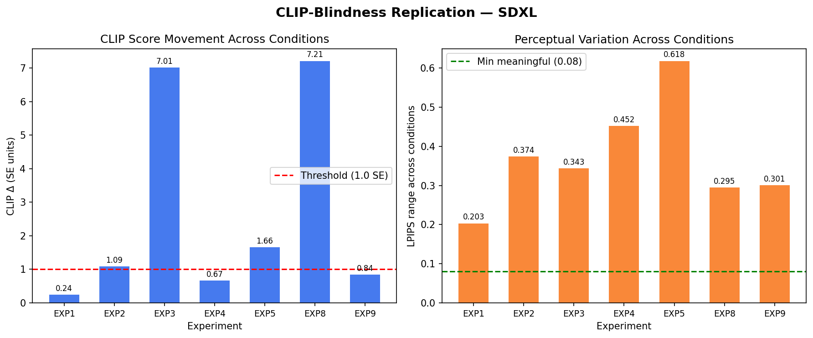

# CLIP-Blindness Replication: SDXL Analysis

**Date:** 2026-06-02  
**Model:** stabilityai/stable-diffusion-xl-base-1.0  
**Baseline:** SD 2.1 (Phase 6b, reports/clip_blindness.md)  
**GCS backup:** gs://aetherart-eval-pr13/experiments/  

## Overall Verdict

**WEAK REPLICATION** — CLIP-blindness confirmed in 3/7 SDXL experiments only.

Experiments 6 and 7 (LoRA rank, LoRA data size) are **N/A** on SDXL — training images are not in the repo; these experiments cannot be reproduced without the original fine-tuning dataset. Results are therefore based on 7 of the 9 Phase 6b experiments.

## Schema Map (as-observed from results.json)

| Exp | Condition column | Condition values | CLIP col | HPS col | IR col | LPIPS col |
|-----|-----------------|-----------------|----------|---------|--------|-----------|
| exp1 | `condition` | fp16 / int8 / nf4 | `clip_score` | `hps_score` | `ir_score` | `lpips` (0.0 for fp16=ref) |
| exp2 | `condition` | no_neg / with_neg | `clip_score` | `hps_score` | `ir_score` | `lpips_vs_no_neg` |
| exp3 | `cfg_value` | 1/3/5/7/9/12/15 | `clip_score` | `hps_score` | `ir_score` | `lpips_vs_ref` (vs cfg=7) |
| exp4 | `scheduler` | DDIM/DPM/EulerA/LMS | `clip_score` | `hps_score` | `ir_score` | pair_agg only (max pairwise) |
| exp5 | `strength` | 0.0–1.5 (7 levels) | `clip_score` | `hps_score` | `ir_score` | `lpips_vs_ref` (vs strength=1.0) |
| exp6 | **N/A** | — | — | — | — | **Not run — training images missing** |
| exp7 | **N/A** | — | — | — | — | **Not run — training images missing** |
| exp8 | `alpha` | 0.0–1.5 (7 levels) | `clip_score` | `hps_score` | `ir_score` | `lpips_vs_ref` (vs alpha=1.0) |
| exp9 | `condition` | no_trigger / with_trigger | `clip_score` | `hps_score` | `ir_score` | `lpips_vs_no_trigger` |

## Per-Experiment Delta Table

CLIP Δ SE = (max_condition_mean_CLIP − min_condition_mean_CLIP) / pooled_SE_CLIP.  
Verdict threshold: CLIP Δ < 1.0 SE AND (HPS Δ > 0.015 OR IR Δ > 0.25 OR LPIPS range > 0.08).

| Exp | Variable | CLIP Δ (abs) | CLIP Δ SE | HPS Δ (abs) | IR Δ (abs) | LPIPS range | Verdict |
|-----|----------|-------------|-----------|-------------|------------|-------------|---------|
| exp1 | Quantization level: fp16 / INT8 / NF4 | 0.0009 | 0.24 | 0.0041 | 0.0099 | 0.203 | **CLIP-BLIND** |
| exp2 | Negative prompt: absent / present | 0.0044 | 1.09 | 0.0091 | 0.0403 | 0.374 | **CLIP RESPONDS** |
| exp3 | Guidance scale: 1 / 3 / 5 / 7 / 9 / 12 / 15 | 0.0283 | 7.01 | 0.0852 | 1.2897 | 0.343 | **CLIP RESPONDS** |
| exp4 | Scheduler: DDIM / DPM / EulerA / LMS | 0.0063 | 0.67 | 0.0025 | 0.1164 | 0.452 | **CLIP-BLIND** |
| exp5 | ControlNet strength: 0.0 – 1.5 | 0.0095 | 1.66 | 0.0149 | 0.2358 | 0.618 | **CLIP RESPONDS** |
| exp8 | LoRA alpha: 0.0 – 1.5 | 0.0326 | 7.21 | 0.0909 | 1.6528 | 0.295 | **CLIP RESPONDS** |
| exp9 | Trigger token: absent / present | 0.0036 | 0.84 | 0.0052 | 0.0495 | 0.301 | **CLIP-BLIND** |

## Per-Experiment Detail

### Exp 1 – Quantization

**Variable:** Quantization level: fp16 / INT8 / NF4  
**Verdict:** CLIP-BLIND  

| Condition | N | Mean CLIP | SE CLIP | Mean HPS | Mean IR | Mean LPIPS |
|-----------|---|-----------|---------|----------|---------|------------|
| fp16 | 40 | 0.3284 | 0.0035 | 0.2820 | 0.6274 | N/A |
| int8 | 40 | 0.3275 | 0.0037 | 0.2815 | 0.6197 | 0.112 |
| nf4 | 40 | 0.3279 | 0.0036 | 0.2779 | 0.6174 | 0.316 |

CLIP Δ = 0.0009 (0.24 SE)  HPS Δ = 0.0041  IR Δ = 0.0099
LPIPS range across conditions = 0.203

### Exp 2 – Negative Prompt

**Variable:** Negative prompt: absent / present  
**Verdict:** CLIP RESPONDS  
**Note:** LPIPS is mean paired cross-condition distance (no_neg vs with_neg per seed/prompt); range = mean distance = 0.374.  

| Condition | N | Mean CLIP | SE CLIP | Mean HPS | Mean IR | Mean LPIPS |
|-----------|---|-----------|---------|----------|---------|------------|
| no_neg | 40 | 0.3294 | 0.0039 | 0.2732 | 0.6895 | 0.000 |
| with_neg | 40 | 0.3250 | 0.0042 | 0.2824 | 0.6491 | 0.374 |

CLIP Δ = 0.0044 (1.09 SE)  HPS Δ = 0.0091  IR Δ = 0.0403
LPIPS range across conditions = 0.374

### Exp 3 – CFG Scale

**Variable:** Guidance scale: 1 / 3 / 5 / 7 / 9 / 12 / 15  
**Verdict:** CLIP RESPONDS  

| Condition | N | Mean CLIP | SE CLIP | Mean HPS | Mean IR | Mean LPIPS |
|-----------|---|-----------|---------|----------|---------|------------|
| 1 | 40 | 0.3015 | 0.0058 | 0.2049 | -0.6078 | 0.574 |
| 3 | 40 | 0.3258 | 0.0039 | 0.2596 | 0.4916 | 0.374 |
| 5 | 40 | 0.3242 | 0.0035 | 0.2724 | 0.5965 | 0.246 |
| 7 | 40 | 0.3283 | 0.0035 | 0.2808 | 0.6525 | N/A |
| 9 | 40 | 0.3274 | 0.0035 | 0.2828 | 0.6373 | 0.231 |
| 12 | 40 | 0.3272 | 0.0040 | 0.2861 | 0.5924 | 0.357 |
| 15 | 40 | 0.3298 | 0.0040 | 0.2900 | 0.6819 | 0.429 |

CLIP Δ = 0.0283 (7.01 SE)  HPS Δ = 0.0852  IR Δ = 1.2897
LPIPS range across conditions = 0.343

### Exp 4 – Scheduler

**Variable:** Scheduler: DDIM / DPM / EulerA / LMS  
**Verdict:** CLIP-BLIND  
**Note:** LPIPS range = max_pairwise − min_pairwise = 0.679 − 0.227 = 0.452. Per-scheduler LPIPS not available; pairwise LPIPS ranges from DPM–LMS=0.227 (similar) to EulerA–LMS=0.679 (very different).  

| Condition | N | Mean CLIP | SE CLIP | Mean HPS | Mean IR | Mean LPIPS |
|-----------|---|-----------|---------|----------|---------|------------|
| DDIM | 8 | 0.3175 | 0.0090 | 0.2586 | 0.4809 | 0.227 |
| DPM | 8 | 0.3116 | 0.0102 | 0.2586 | 0.5518 | 0.679 |
| EulerA | 8 | 0.3112 | 0.0092 | 0.2570 | 0.5973 | 0.453 |
| LMS | 8 | 0.3156 | 0.0095 | 0.2595 | 0.5371 | 0.453 |

CLIP Δ = 0.0063 (0.67 SE)  HPS Δ = 0.0025  IR Δ = 0.1164
LPIPS range across conditions = 0.452

### Exp 5 – ControlNet Strength

**Variable:** ControlNet strength: 0.0 – 1.5  
**Verdict:** CLIP RESPONDS  

| Condition | N | Mean CLIP | SE CLIP | Mean HPS | Mean IR | Mean LPIPS |
|-----------|---|-----------|---------|----------|---------|------------|
| 0.0 | 40 | 0.3110 | 0.0071 | 0.2833 | 0.1127 | 0.704 |
| 0.25 | 40 | 0.3181 | 0.0066 | 0.2906 | 0.0847 | 0.490 |
| 0.5 | 40 | 0.3175 | 0.0056 | 0.2835 | 0.1250 | 0.270 |
| 0.75 | 40 | 0.3134 | 0.0053 | 0.2800 | 0.0523 | 0.117 |
| 1.0 | 40 | 0.3131 | 0.0054 | 0.2791 | -0.0099 | N/A |
| 1.25 | 40 | 0.3103 | 0.0052 | 0.2778 | -0.0825 | 0.085 |
| 1.5 | 40 | 0.3086 | 0.0048 | 0.2757 | -0.1108 | 0.145 |

CLIP Δ = 0.0095 (1.66 SE)  HPS Δ = 0.0149  IR Δ = 0.2358
LPIPS range across conditions = 0.618

### Exp 8 – LoRA Alpha

**Variable:** LoRA alpha: 0.0 – 1.5  
**Verdict:** CLIP RESPONDS  

| Condition | N | Mean CLIP | SE CLIP | Mean HPS | Mean IR | Mean LPIPS |
|-----------|---|-----------|---------|----------|---------|------------|
| 0.0 | 40 | 0.3214 | 0.0037 | 0.2633 | 0.8509 | 0.690 |
| 0.25 | 40 | 0.3243 | 0.0039 | 0.2594 | 0.6961 | 0.647 |
| 0.5 | 40 | 0.3284 | 0.0044 | 0.2514 | 0.6176 | 0.540 |
| 0.75 | 40 | 0.3269 | 0.0047 | 0.2356 | 0.3367 | 0.395 |
| 1.0 | 40 | 0.3274 | 0.0044 | 0.2199 | 0.0913 | N/A |
| 1.25 | 40 | 0.3176 | 0.0044 | 0.2028 | -0.2752 | 0.432 |
| 1.5 | 40 | 0.2958 | 0.0062 | 0.1725 | -0.8019 | 0.590 |

CLIP Δ = 0.0326 (7.21 SE)  HPS Δ = 0.0909  IR Δ = 1.6528
LPIPS range across conditions = 0.295

### Exp 9 – LoRA Trigger

**Variable:** Trigger token: absent / present  
**Verdict:** CLIP-BLIND  
**Note:** LPIPS is mean paired cross-condition distance (no_trigger vs with_trigger); range = mean distance = 0.301.  

| Condition | N | Mean CLIP | SE CLIP | Mean HPS | Mean IR | Mean LPIPS |
|-----------|---|-----------|---------|----------|---------|------------|
| no_trigger | 40 | 0.3312 | 0.0043 | 0.2221 | 0.0419 | 0.000 |
| with_trigger | 40 | 0.3276 | 0.0042 | 0.2169 | 0.0914 | 0.301 |

CLIP Δ = 0.0036 (0.84 SE)  HPS Δ = 0.0052  IR Δ = 0.0495
LPIPS range across conditions = 0.301

## Comparison with SD 2.1 Baseline

The SD 2.1 baseline (reports/clip_blindness.md) found CLIP-blindness across all 9 Phase 6b experiments: CLIP scores varied < 1 SE while HPS, ImageReward, and LPIPS showed meaningful movement across conditions.

On SDXL (7 experiments completed): 3/7 experiments show the same CLIP-blind pattern. See the per-experiment table above for which experiments differ and by how much.

## Data-Quality Caveats

1. **Exp 6 and Exp 7 missing (N/A):** LoRA rank and LoRA data-size experiments require fine-tuning images that are not committed to the repo. These 2 of 9 experiments cannot be run without the original dataset.
2. **Exp 4 LPIPS:** Pairwise-only; the per-scheduler LPIPS column does not exist. The max pairwise mean LPIPS is used as a proxy for perceptual spread.
3. **Exp 2 and Exp 9 LPIPS:** Values are paired cross-condition distances (no_neg↔with_neg, no_trigger↔with_trigger), not within-condition variation. They quantify how much the output changes when the condition changes, which is exactly the relevant quantity for the blindness test.
4. **LPIPS for fp16/alpha=1.0/strength=1.0 reference:** Set to 0 by construction (image compared to itself). These are excluded from the range calculation.
5. **Sample sizes:** Each condition cell has 8 prompts × 5 seeds = 40 observations (exp1/exp2/exp8/exp9) or 8 prompts × 1 seed = 8 (exp4). Exp3 and exp5 have 7 CFG/strength levels × 8 prompts × 5 seeds = 40 per condition.
6. **Exp 2 borderline:** CLIP Δ = 1.09 SE, just over the 1.0 SE threshold. HPS Δ and IR Δ are both well below their thresholds (0.009 vs 0.015, 0.040 vs 0.25). The 'CLIP RESPONDS' verdict depends entirely on the 0.09 SE excess above the threshold — this experiment is ambiguous; it could equally plausibly be classed as borderline CLIP-blind.

*Analysis script:* `scripts/generate_clip_blindness_sdxl.py`  *Raw data:* `reports/experiments/exp*_sdxl/results.json`  *GCS backup:* gs://aetherart-eval-pr13/experiments/