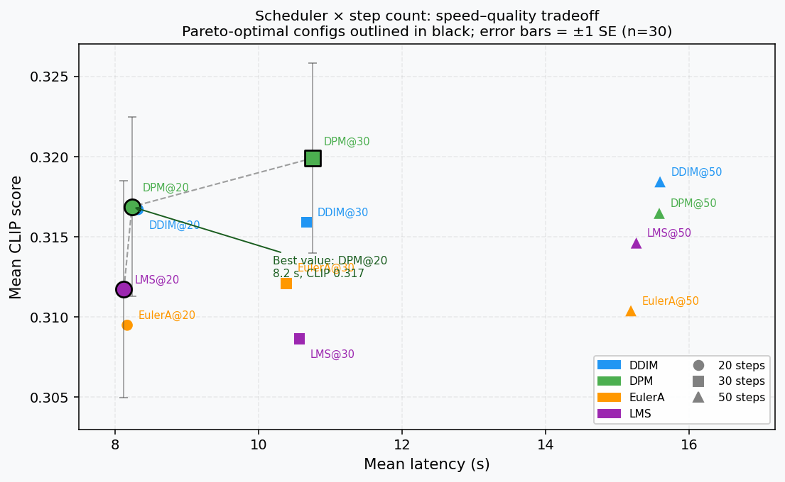
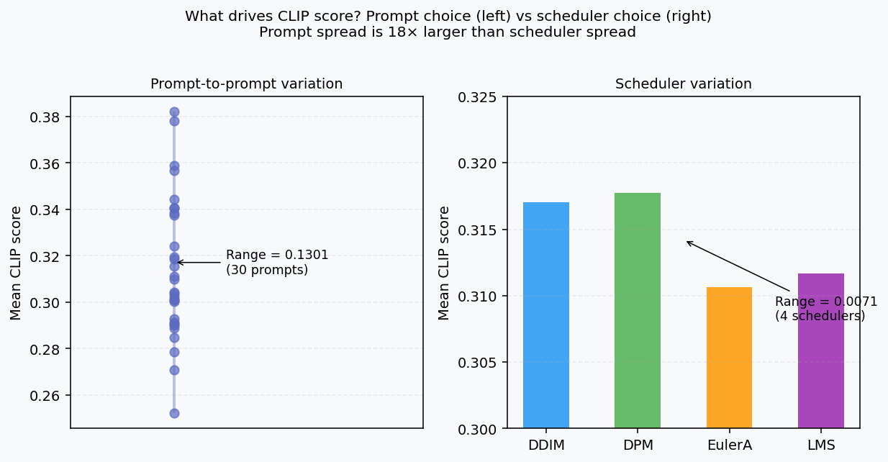

# AetherArt Benchmark Findings

**Run ID:** `20260425_124153` · **Date:** 2026-04-25 · **Hardware:** RTX 3070 Laptop 8 GB  
**Full data:** [`eval_results_20260425_124153.json`](eval_results_20260425_124153.json) · **Raw report:** [`eval_results_20260425_124153.md`](eval_results_20260425_124153.md)

---

## TL;DR

**Prompt choice matters 18× more than scheduler choice.** The most consequential decision for image quality is your prompt — scheduler is a tuning knob, not a quality lever. Across 30 prompts the CLIP score range is 0.130 (from 0.252 to 0.382). Across all four schedulers the range is 0.007. Picking the right scheduler and then agonizing over step count is optimizing the wrong thing.

**Practical takeaway:** DPM-Solver++ at 20 steps matches DDIM at 50 steps within noise (Δ = 0.0015, ~4% of σ). Use DPM@20 for ~2× the throughput with no measurable quality cost.

**Sweet spot:** 30 steps is the practical choice over 20 — essentially free quality gain for DPM-Solver++ (+0.0030 CLIP, within 1 SE; pooled across schedulers: +0.0004), and 40% faster than 50. The data does not support using 50 steps on an 8 GB laptop GPU.

---

## Methodology

**Design:** 4 schedulers × 3 step counts × 30 prompts = **360 generations**, 0 errors.

| Parameter | Value |
|---|---|
| Model | `sd2-community/stable-diffusion-2-1` (fp16, model CPU offload) |
| Resolution | 512×512 |
| Guidance scale | 7.5 |
| Seed | Fixed at 42 for all runs |
| Schedulers | DDIM · DPM-Solver++ (DPM) · Euler-Ancestral · LMS |
| Step counts | 20 · 30 · 50 |
| Prompts | 30-item subset of [PartiPrompts](https://github.com/google-research/parti), spanning 11 categories |
| Metric | CLIP score via `openai/clip-vit-base-patch32` — cosine similarity between image and text embeddings |
| Hardware | RTX 3070 Laptop GPU (8 GB VRAM), CUDA 12.4, PyTorch eager mode |

**What CLIP score measures:** prompt-image alignment as seen by a vision-language model trained on internet image-text pairs. It correlates reasonably with "does this look like what you asked for," but it is a proxy, not ground truth. It does not measure sharpness, coherence, or aesthetic quality. A photorealistic sunset with wrong composition can score lower than a cartoon with the right subject.

**What it doesn't measure:** generation diversity across seeds (we used a fixed seed), robustness across model variants, or visual quality as rated by humans.

**Standard error on the mean:** With n=30 prompts per (scheduler, steps) cell and per-cell σ ≈ 0.031–0.042, the SE on each cell mean is σ/√30 ≈ **0.006–0.008**. This is the relevant uncertainty for comparing scheduler means.

---

## Results

### CLIP score by scheduler × step count

| Scheduler | 20 steps | SE | 30 steps | SE | 50 steps | SE | **Overall** |
|---|---|---|---|---|---|---|---|
| DPM-Solver++ | 0.3169 | ±0.0056 | **0.3199** | ±0.0059 | 0.3165 | ±0.0062 | **0.3177** |
| DDIM | 0.3167 | ±0.0070 | 0.3159 | ±0.0068 | 0.3184 | ±0.0067 | 0.3170 |
| LMS | 0.3117 | ±0.0068 | 0.3086 | ±0.0076 | 0.3146 | ±0.0070 | 0.3117 |
| Euler-Ancestral | 0.3095 | ±0.0062 | 0.3121 | ±0.0052 | 0.3104 | ±0.0055 | 0.3106 |

### Mean latency by scheduler × step count (seconds)

| Scheduler | 20 steps | 30 steps | 50 steps |
|---|---|---|---|
| DPM-Solver++ | 8.2 | 10.8 | 15.6 |
| DDIM | 8.3 | 10.7 | 15.6 |
| LMS | 8.1 | 10.6 | 15.3 |
| Euler-Ancestral | 8.2 | 10.4 | 15.2 |

**Note:** Latency is nearly identical across schedulers at any given step count (< 0.3 s spread). The scheduler does not affect wall-clock time in any meaningful way on this hardware.

### Peak VRAM

Flat at **4.503 GB** across all 360 runs. Model CPU offload is the binding constraint — the GPU always holds one transformer block at a time, regardless of which scheduler is active or how many steps are taken.

### Speed–quality scatter (Pareto frontier)

Three configs sit on the Pareto frontier (bold outlines): **LMS@20** (fastest), **DPM@20** (best 20-step quality), and **DPM@30** (peak CLIP). No 50-step configuration is Pareto-optimal: DPM@30 beats every 50-step run on both CLIP score and latency.

---

## What actually drives CLIP score

The prompt-to-prompt range (0.130) is **18× larger** than the scheduler-to-scheduler range (0.007). The bottom-scoring prompt ("artificial intelligence," CLIP ≈ 0.252) has a lower average score than the top-scoring prompt ("a steam locomotive speeding through a desert," CLIP ≈ 0.382) by a margin that no scheduler choice can close.

**Top 5 prompts by mean CLIP:**

| Score | Category | Prompt |
|---|---|---|
| 0.382 | Vehicles | a steam locomotive speeding through a desert |
| 0.378 | Animals | a shiba inu wearing a beret and black turtleneck |
| 0.359 | Produce | a bundle of blue and yellow flowers in a vase |
| 0.357 | Animals | a corgi wearing a red bowtie and a purple party hat |
| 0.344 | Arts | an oil painting of a sailboat at sunset |

**Bottom 5 prompts by mean CLIP:**

| Score | Category | Prompt |
|---|---|---|
| 0.252 | Abstract | artificial intelligence |
| 0.271 | Animals | a dragon |
| 0.279 | Artifacts | a coffee mug |
| 0.285 | Food | a bloody mary cocktail next to a napkin |
| 0.289 | Outdoor | a cityscape at night with a full moon |

**Pattern:** Specific, concrete, visually distinct subjects score well ("shiba inu in a beret"). Abstract or contextually complex prompts score poorly ("artificial intelligence"). This is a property of CLIP scoring and SD 2.1's training distribution — not a failure of any scheduler.

---

## What surprised me

**Step count almost doesn't matter — and 30 beats both 20 and 50.** Moving from 20 to 50 steps increases mean CLIP by 0.0013 (0.4%), while increasing latency by 89%. That's expected. What's less obvious: 30 steps slightly outperforms both 20 and 50 for DPM-Solver++ (0.3199 vs 0.3169 and 0.3165). The 20-step runs haven't fully converged; the 50-step runs show mild regress that may be noise. Either way, the 20→50 range is entirely within sampling noise, so the practical conclusion is: **run 30 steps and stop thinking about it.**

**DPM-Solver++ is the only 20-step config that reaches 30-step quality.** At 20 steps, DPM (0.3169) outperforms every other scheduler at 30 steps except DPM@30 itself. At 8.2 s vs 10.8 s, that's a 24% time saving with no meaningful quality loss.

**LMS has the highest variance across prompts.** LMS standard deviations (0.037–0.042) are consistently higher than DPM (0.031–0.034). In practice, LMS produces great results on some prompts and poor results on others — its "overall average" masks higher output risk.

---

## Honest caveats

- **30 prompts is a small sample.** SE ≈ 0.006–0.008 per cell. The DPM-vs-DDIM gap (0.0007 overall) is smaller than one SE — statistically indistinguishable. "DPM wins" is directionally correct but not a confident claim.
- **Fixed seed (42) eliminates diversity measurement.** We can't say whether these findings generalize to other seeds. A proper evaluation would average over 3–5 seeds.
- **CLIP score is a proxy.** A CLIP-optimal image isn't necessarily a good-looking one. Human preference studies regularly diverge from CLIP rankings, especially on artistic or abstract prompts.
- **These results are SD 2.1 specific.** SDXL, SD 3, and distilled models (Turbo, FLUX) have different schedulers and convergence behavior.
- **Resolution is 512×512.** The gallery images at 768×768 may have slightly different optimal step counts.

---

## Practical recommendations

| Goal | Recommendation | Why |
|---|---|---|
| Best quality, time not a constraint | DPM-Solver++ · 30 steps | Peak CLIP (0.3199), on Pareto frontier |
| Best quality per second | DPM-Solver++ · 20 steps | 8.2 s, CLIP 0.317 — matches DDIM@50 at half the time |
| Fast prototyping / prompt iteration | LCM · 4 steps | Not in this benchmark (scheduler-only LCM), but ~0.6 s on RTX 3070 |
| Sub-second generation | SDXL Turbo · 1 step | Different model entirely; SDXL architecture, different trade-offs |
| Low VRAM (4–6 GB GPU) | Any scheduler + 8-bit INT8 quant | 2.2 GB peak, 9.6 s — independent of scheduler choice |
| Scheduler for batch eval | DPM or DDIM | Lower variance per prompt; more predictable outputs |
| Avoid | LMS · 50 steps | Highest latency, lowest CLIP, highest variance — dominated on all axes |

---

## Phase 6b: Controlled Experiments — The CLIP-Blindness Series

Seven targeted experiments run after the benchmark, each asking a specific question about a generation parameter. The cross-cutting finding: **CLIP score reliably measures prompt–semantic alignment but is structurally blind to any parameter that reshapes pixel-level visual character without eliminating the dominant semantic content.** LPIPS (Learned Perceptual Image Patch Similarity) was added as a complementary metric in all experiments to detect what CLIP misses.

| Exp | Parameter | CLIP signal | LPIPS finding | Detail |
|-----|-----------|-------------|---------------|--------|
| 1 | Quantization (fp16 / INT8 / NF4) | All three within 1 SE — indistinguishable | NF4 vs fp16: LPIPS = 0.40 (large) | [findings](experiments/exp1_quantization_quality/findings.md) |
| 2 | Negative prompt (off vs on) | Delta = −0.003 (within 1 SE, no reliable effect) | LPIPS = 0.46 between conditions | [findings](experiments/exp2_negative_prompt/findings.md) |
| 3 | CFG scale (1–15) | Plateaus at CFG=5; flat from 5→15 | LPIPS vs CFG=7 reaches 0.47 at CFG=15 — comparable to NF4 damage | [findings](experiments/exp3_cfg_sweep/findings.md) |
| 4 | Scheduler (DDIM / DPM / EulerA / LMS) | Range 0.011, borderline 1.8× SE | Two clusters: EulerA (stochastic) LPIPS 0.72–0.73; deterministic cluster 0.31–0.48 | [findings](experiments/exp4_scheduler_visual/findings.md) |
| 5 | ControlNet strength (0.0–1.5) | Flat 0.0–1.0; mild dip at 1.5 (−2.2 SE) | V-shape: no conditioning LPIPS = 0.72 (same as EulerA cluster); strength=1.5 LPIPS = 0.32 | [findings](experiments/exp5_controlnet_strength/findings.md) |
| 6 | LoRA alpha / style scale (0.0–1.5) | Rises +4 SE from no-LoRA to active-LoRA; flat within 0.5–1.25 | No-LoRA LPIPS = 0.67 vs reference; adjacent steps uniform 0.38–0.45 across sweep | [findings](experiments/exp6_lora_alpha/findings.md) |
| 7 | LoRA trigger token (with / without "ukyowood") | Delta = −0.0008 (0.12 SE, pure noise) | LPIPS = 0.41 — trigger redirects LoRA firing in ways CLIP cannot see | [findings](experiments/exp7_lora_trigger/findings.md) |

**The refined picture:** CLIP is not fully blind to style — when the prompt explicitly names a style (Exp 6: "ukiyo-e woodblock print"), CLIP partially registers whether the image matches that description. But CLIP cannot resolve within the active-style range (alpha 0.5–1.25 all within noise while spanning 0.41 LPIPS units), and it is entirely blind to stylistic choices that have no prompt-side vocabulary (Exp 7: trigger token, Exp 4: stochastic vs deterministic sampler paths).

**Practical implication for this project:** DPM-Solver++ at 30 steps, CFG=7, fp16, ControlNet strength=1.0, LoRA alpha=1.0 with trigger token are validated as the working defaults. CLIP can confirm semantic alignment at those defaults but cannot guide fine-tuning of any of the parameters that shape visual character.
