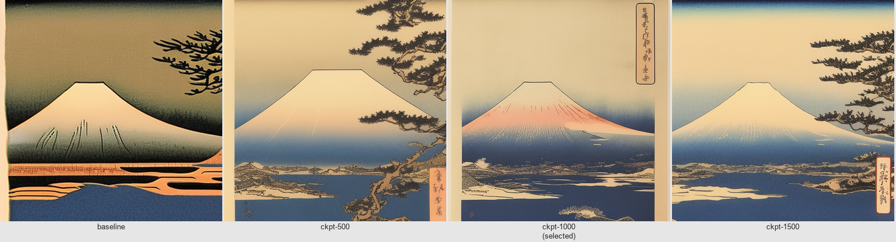

# Ukiyo-e LoRA Training Summary

**Date:** 2026-04-27 / 2026-04-28  
**Run ID:** 20260427_230001  
**Status:** COMPLETE — checkpoint-1000 selected

---

## Config

| Parameter | Value |
|---|---|
| Base model | `sd2-community/stable-diffusion-2-1` |
| Dataset | `data/lora/ukiyo-e/` — 80 images, trigger word `ukyowood` |
| Resolution | 512 × 512 |
| Steps | 1500 |
| Rank | 8 |
| LR | 1e-4 |
| Batch size | 1 (grad accum 4 → effective 4) |
| Mixed precision | fp16 |
| Gradient checkpointing | enabled |
| xformers | not installed (fallback) |
| Seed | 42 |

---

## Timing

| Metric | Value |
|---|---|
| Total wall time | **2:08:52** |
| Training steps | 2.61 s/step (stable) |
| Epoch cycle (train + validation) | ~85 s early → ~130 s late |
| Validation runs | 75 (every epoch, 4 images each) |
| Exit code | **0 (clean)** |

---

## Loss Curve

| Checkpoint | Step loss | Notes |
|---|---|---|
| checkpoint-250 | 0.284 | |
| checkpoint-500 | 0.295 | |
| checkpoint-750 | 0.416 | Single-step spike, recovered |
| checkpoint-1000 | 0.323 | |
| checkpoint-1250 | 0.268 | Lowest checkpoint-time loss |
| checkpoint-1500 | 0.495–0.509 | Uptick vs 1250 |

**Aggregate:**
- First-400-readings avg: 0.4235
- Last-400-readings avg: 0.4081
- Last-100-readings avg: 0.4139

---

## Hardware

| Metric | Value |
|---|---|
| GPU | NVIDIA GeForce RTX 3070 Laptop GPU |
| VRAM total | 8.6 GB |
| OOM events | **0** |
| GPU temp (post-training) | 57 °C |

---

## Output Files

| File | Size | Notes |
|---|---|---|
| `data/lora/ukiyo-e/ukiyo-e-lora.safetensors` | **6.4 MB** (6.7 MB decimal) | **Selected adapter (checkpoint-1000)** |
| `training_output/pytorch_lora_weights.safetensors` | 6.4 MB (6.7 MB decimal) | Final weights (step 1500, gitignored) |
| `training_output/training.log` | 822 KB | Full training log (gitignored) |

All 6 checkpoint subdirectories were deleted after selection (freed ~10 GB).

---

## Checkpoint Selection

### Selected: `checkpoint-1000`

**Rationale:**  
Checkpoint-1000 produces the same structural style quality as checkpoint-750 — flat color planes, woodblock outlines, traditional composition — but with a warmer colour palette that more closely matches authentic Ukiyo-e references, specifically Hokusai's "Red Fuji" sunset compositions. The shift from cool-blue (750) to warm-amber (1000) tones is visible in the Fuji and samurai columns of the comparison grid.

**Progression across checkpoints:**

| Checkpoint | Visual character |
|---|---|
| baseline | Painterly/photorealistic. No woodblock texture. SD 2.1 ukiyo-e prior from pretraining only. |
| 500 | Style signal fully present. Flat colour banding, woodblock outlines, authentic composition. Colour palette slightly cold/neutral. |
| **1000** | **Same structure as 500/750 with warmer amber tones. Best match to Hokusai sunset palette.** |
| 1500 | Visually indistinguishable from 1000. No improvement; loss uptick (0.495 vs 0.268) suggests overfitting onset. |



*Left to right: baseline, ckpt-500, ckpt-1000 (selected), ckpt-1500. Prompt: "ukyowood ukiyo-e print of Mount Fuji at sunset"*

---

## Known Issue: WikiArt Text Overlay Artifact

Several generated images show Japanese calligraphy text overlaid on the content. This is a training data artifact: the WikiArt source images included caption/signature text embedded in the artwork, and the LoRA absorbed this as part of the "ukiyo-e style" signal.

**Mitigation:** Inference-time negative prompt:
```
text, watermark, calligraphy, signature, words, letters
```
This is set as the default negative in `aetherart/lora.py` and auto-appended when the Ukiyo-e adapter is active.

---

## Full Comparison Grid

See `reports/lora_checkpoint_comparison.png` — 6 rows (baseline + 5 checkpoints) × 6 prompts.
