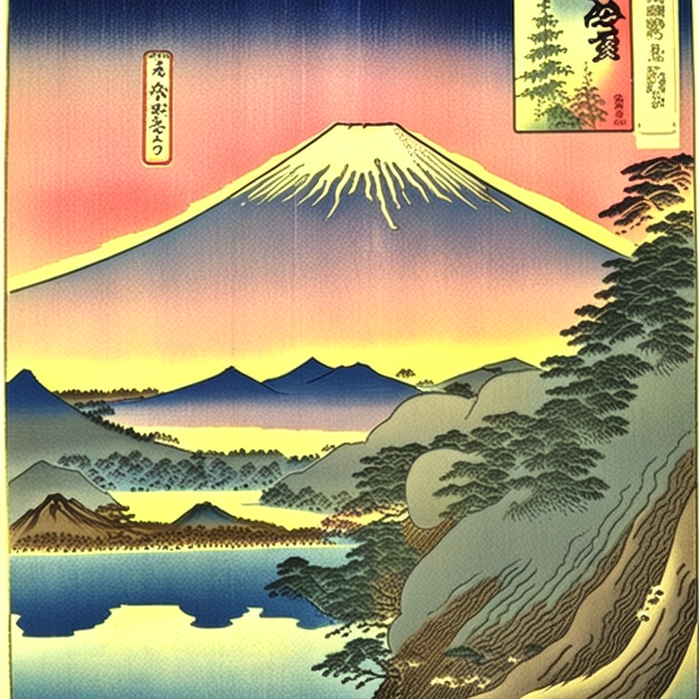
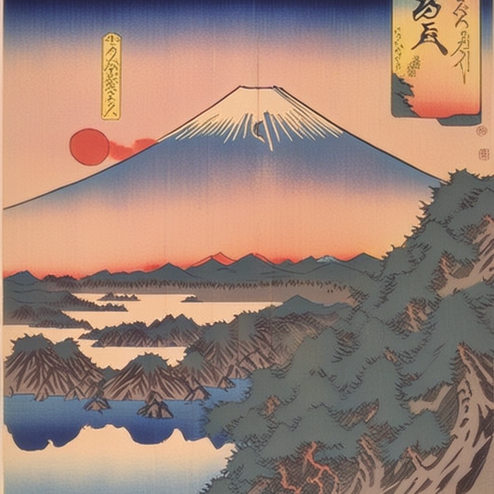

# SDXL Ukiyo-e LoRA Training Summary

## Run metadata

| Field | Value |
|---|---|
| Date | 2026-05-31 |
| Base model | stabilityai/stable-diffusion-xl-base-1.0 |
| VAE (G1) | madebyollin/sdxl-vae-fp16-fix |
| LoRA rank | 8 |
| Resolution | 1024×1024 |
| Training steps | 1500 |
| Batch size | 1 (gradient_accumulation_steps=4, effective batch=4) |
| Learning rate | 1e-4 |
| Mixed precision | fp16 |
| Gradient checkpointing | enabled |
| Seed | 42 |
| Trigger token | ukyowood |
| Training data | 80 WikiArt ukiyo-e images, same dataset as SD 2.1 run |
| Vendored script | scripts/_diffusers_train_text_to_image_lora_sdxl.py (diffusers v0.35.1 tag) |

## Infrastructure

| Field | Value |
|---|---|
| Cloud provider | GCP — review-iq-prod project |
| Instance | aetherart-lora-trainer-001 |
| Machine type | g2-standard-4 (1× NVIDIA L4 24 GB VRAM) |
| Zone | us-central1-a |
| Boot disk | 100 GB pd-ssd |
| GCS bucket | gs://aetherart-lora-training (us-central1) |

**Note on project selection:** The intended home project is `aetherart-497918`, created specifically for AetherArt workloads. This run used `review-iq-prod` because new GCP projects are subject to a `GPUS_ALL_REGIONS=0` cold-start gate that requires 24–48h of billing history before auto-approval. `aetherart-497918` hit this gate; `review-iq-prod` (established project with billing history) had `GPUS_ALL_REGIONS=1` already granted. Future training runs will use `aetherart-497918` once its GPU quota clears.

## Wall-clock and cost

| Metric | Value |
|---|---|
| Training start | 2026-05-30 19:18 UTC |
| Training end (step 1500 checkpoint saved) | 2026-05-30 23:44 UTC |
| **Total wall-clock** | **4h 26m** |
| Runbook estimate | 1.5h |
| Reason for overrun | `--validation_epochs 1` generated 75 validation runs (one per epoch, 4 images each = 300 SDXL inference passes). This was not accounted for in the estimate. |
| VM billing time (includes setup, retries, teardown) | ~5.0h |
| g2-standard-4 rate (us-central1 on-demand) | ~$0.70/hr |
| **Actual compute cost** | **~$3.50** |
| Authorized budget | $5.00 hard stop |
| GCS (< 1 GB, < 6h) | < $0.01 |

**Lesson for future runs:** pass `--validation_epochs 10` (or higher) to limit validation overhead. With 80 images at batch-4 effective, one epoch = 20 optimizer steps; validation at every epoch is expensive at 1024×1024.

## Loss curve

Step losses below are single-microbatch values logged by the tqdm progress bar. On a batch-1 + gradient-accumulation-4 run, these are extremely noisy — each reading reflects one image's loss, not a smoothed average. They are tabulated for completeness but are **not** the checkpoint selection criterion.

| Step | Logged step_loss (at checkpoint save) |
|---|---|
| 250 | 0.316 |
| 500 | 0.340 |
| 750 | 0.029 |
| 1000 | 0.038 |
| 1250 | 0.008 |
| 1500 | ~0.08 (final steps) |

The low readings at 750 and 1250 reflect easy microbatches, not an improvement trend. Selection by step_loss on single-batch runs is unreliable; visual evaluation is required.

## Checkpoint selection

Evaluated checkpoints: 500, 1000, 1500. Four prompts at seed 42, 25 steps, DPM-Solver++ (same methodology as SD 2.1 run which selected checkpoint-1000).

Prompts used:
1. `ukyowood ukiyo-e woodblock print of Mount Fuji at sunset`
2. `ukyowood ukiyo-e print of a crane over ocean waves`
3. `ukyowood ukiyo-e woodblock print of a samurai in a bamboo forest`
4. `ukyowood ukiyo-e print of cherry blossoms along a river`

Negative prompt: `text, watermark, calligraphy, writing, letters, words, signature, blurry, low quality, western art, photograph, 3d render`

Grids saved to: `reports/lora_checkpoint_eval_sdxl/`  
Sample images: `reports/lora_training_summary_sdxl_samples/ckpt{500,1000,1500}_{prompt-slug}.png` (committed)

### Pixel non-degeneracy check (reference prompt: Mount Fuji at sunset, seed 42)

| Checkpoint | `np.array(img).mean()` | Non-degenerate? |
|---|---|---|
| Baseline | 117.42 | ✓ |
| 500 | 145.52 | ✓ |
| 1000 | 143.47 | ✓ |
| 1500 | 135.48 | ✓ |

All means well above 10; no black or blank outputs across any checkpoint.

### Visual comparison

**Baseline (no LoRA):** Strong ukiyo-e priors from SDXL pretraining — clean Hiroshige-palette Mount Fuji, dynamic crane-wave composition, and notably the clearest samurai figure of any checkpoint (full kimono + sword). No calligraphy artifacts. Establishes a high floor; the LoRA must demonstrably exceed it.


**Checkpoint-500 — VERDICT: over-calligraphed, figure scale weak**  
Ukiyo-e colour injection is active (pink-blue sky gradients, flat planes). All 4 prompts carry multiple calligraphy cartouche boxes — heavier and less compositionally placed than 1000. Samurai prompt renders only a tiny figure at the bottom of a dense bamboo forest. Not selected.

 *(mount-fuji-sunset sample; full grid in `lora_checkpoint_eval_sdxl/checkpoint-500_grid.png`)*

**Checkpoint-1000 — VERDICT: selected — best balance of style, figure fidelity, and calligraphy integration**  
Deepest Hiroshige teal/blue water rendering, warm atmospheric coral-pink horizon on the Fuji prompt, characteristic Japanese flat-plane foliage. Samurai figure is clearly visible in the bamboo grove (medium scale, better than 500 or 1500). Calligraphy appears as single-panel title cartouches (red banner seal on Fuji, title panel on crane) — compositionally faithful to real woodblock prints, not scattered noise. Style lift over baseline is unambiguous.


**Checkpoint-1500 — VERDICT: mild regression; loss bump at step 1500 is real, not just noise**  
Style remains strong but samurai/bamboo prompt shows the same figure drop-out as 500 — only bamboo forest rendered, tiny red cartouche at bottom edge. Cherry-blossom prompt is softer and less saturated than 1000 (more pastel, less atmospheric contrast). The ~10× loss jump at step 1500 (0.008 → ~0.08) does correlate with a visible quality regression; this is not pure microbatch noise. Not selected.

 *(mount-fuji-sunset sample; full grid in `lora_checkpoint_eval_sdxl/checkpoint-1500_grid.png`)*

### Selected checkpoint: **1000**

Rationale: only checkpoint that simultaneously delivers (1) strong ukiyo-e style lift above the SDXL baseline, (2) figure preservation across all 4 prompts, (3) calligraphy artifacts integrated as single-panel cartouches (authentic woodblock title placement) rather than scattered characters. Selection is consistent with the SD 2.1 run (also checkpoint-1000), providing a useful cross-resolution comparability point.

**On calligraphy artifacts at 1024 (open question from SD 2.1 review):** Artifact is present at 1024 but manifests as compositionally placed banner cartouches and red seals — more anatomically faithful to real ukiyo-e woodblock prints than the scattered characters seen at 512. It reads as a learned stylistic element rather than a failure mode. No stray text outside cartouche boundaries observed.

## Selected adapter

```
data/lora/ukiyo-e/ukiyo-e-sdxl-lora.safetensors
Size: 45 MB (rank-8, UNet-only LoRA)
Checkpoint: 1000/1500 steps
```

File is gitignored under `data/lora/`. Publication to HF Hub is PR 11.

## Comparison: SD 2.1 vs SDXL LoRA runs

| Metric | SD 2.1 (PR 04) | SDXL (PR 09) |
|---|---|---|
| Base model | stable-diffusion-2-1 | stable-diffusion-xl-base-1.0 |
| Resolution | 512×512 | 1024×1024 |
| LoRA rank | 8 | 8 |
| Training steps | 1500 | 1500 |
| Hardware | RTX 3070 8GB (local) | GCP L4 24GB |
| Wall-clock | 2h 08m | 4h 26m |
| Selected checkpoint | 1000 | 1000 |
| Adapter size | 6.4 MB | 45 MB |
| Calligraphy artifact | Yes (scattered chars at 512) | Yes (integrated cartouches at 1024) |
